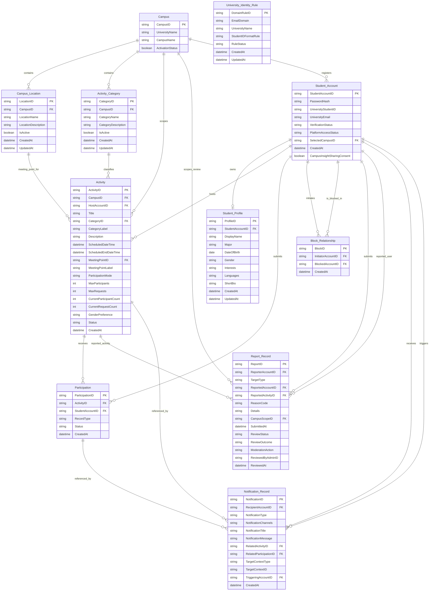

# ERD v1.1

```mermaid
erDiagram
	direction TB
	Campus {
		string CampusID PK ""  
		string UniversityName  ""  
		string CampusName  ""  
		boolean ActivationStatus  ""  
	}

	Campus_Location {
		string LocationID PK ""  
		string CampusID FK ""  
		string LocationName  ""  
		string LocationDescription  ""  
		boolean IsActive  ""  
		datetime CreatedAt  ""  
		datetime UpdatedAt  ""  
	}

	Activity_Category {
		string CategoryID PK ""  
		string CampusID FK ""  
		string CategoryName  ""  
		string CategoryDescription  ""  
		boolean IsActive  ""  
		datetime CreatedAt  ""  
		datetime UpdatedAt  ""  
	}

	Student_Account {
		string StudentAccountID PK ""  
		string PasswordHash  ""  
		string UniversityStudentID  ""  
		string UniversityEmail  ""  
		string VerificationStatus  ""  
		string PlatformAccessStatus  ""  
		string SelectedCampusID FK ""  
		datetime CreatedAt  ""  
                boolean CampusInsightSharingConsent ""
	}

	Student_Profile {
		string ProfileID PK ""  
		string StudentAccountID FK ""  
		string DisplayName  ""  
		string Major  ""  
		date DateOfBirth  ""  
		string Gender  ""  
		string Interests  ""  
		string Languages  ""  
		string ShortBio  ""  
		datetime CreatedAt  ""  
		datetime UpdatedAt  ""  
	}

	University_Identity_Rule {
		string DomainRuleID PK ""  
		string EmailDomain  ""  
		string UniversityName  ""  
		string StudentIDFormatRule  ""  
		string RuleStatus  ""  
		datetime CreatedAt  ""  
		datetime UpdatedAt  ""  
	}

	Activity {
		string ActivityID PK ""  
		string CampusID FK ""  
		string HostAccountID FK ""  
		string Title  ""  
		string CategoryID FK ""  
		string CategoryLabel  ""  
		string Description  ""  
		datetime ScheduledDateTime  ""  
		datetime ScheduledEndDateTime  ""  
		string MeetingPointID FK ""  
		string MeetingPointLabel  ""  
		string ParticipationMode  ""  
		int MaxParticipants  ""  
		int MaxRequests  ""  
		int CurrentParticipantCount  ""  
		int CurrentRequestCount  ""  
		string GenderPreference  ""  
		string Status  ""  
		datetime CreatedAt  ""  
	}

	Participation {
		string ParticipationID PK ""  
		string ActivityID FK ""  
		string StudentAccountID FK ""  
		string RecordType  ""  
		string Status  ""  
		datetime CreatedAt  ""  
	}

	Block_Relationship {
		string BlockID PK ""  
		string InitiatorAccountID FK ""  
		string BlockedAccountID FK ""  
		datetime CreatedAt  ""  
	}

	Report_Record {
		string ReportID PK ""  
		string ReporterAccountID FK ""  
		string TargetType  ""  
		string ReportedAccountID FK ""  
		string ReportedActivityID FK ""  
		string ReasonCode  ""  
		string Details  ""  
		string CampusScopeID FK ""  
		datetime SubmittedAt  ""  
		string ReviewStatus  ""  
		string ReviewOutcome  ""  
		string ModerationAction  ""  
		string ReviewedByAdminID  ""  
		datetime ReviewedAt  ""  
	}

	Notification_Record {
		string NotificationID PK ""  
		string RecipientAccountID FK ""  
		string NotificationType  ""  
		string NotificationChannels  ""  
		string NotificationTitle  ""  
		string NotificationMessage  ""  
		string RelatedActivityID FK ""  
		string RelatedParticipationID FK ""  
		string TargetContextType  ""  
		string TargetContextID  ""  
		string TriggeringAccountID FK ""  
		datetime CreatedAt  ""  
	}

	Campus||--o{Campus_Location:"contains"
	Campus||--o{Activity_Category:"contains"
	Campus||--o{Activity:"scopes"
	Campus||--o{Report_Record:"scopes_review"
	Campus||--o{Student_Account:"registers"
	Student_Account||--o|Student_Profile:"owns"
	Student_Account||--o{Activity:"hosts"
	Activity_Category||--o{Activity:"classifies"
	Campus_Location||--o{Activity:"meeting_point_for"
	Activity||--o{Participation:"receives"
	Student_Account||--o{Participation:"submits"
	Student_Account||--o{Block_Relationship:"initiates"
	Student_Account||--o{Block_Relationship:"is_blocked_in"
	Student_Account||--o{Report_Record:"submits"
	Student_Account||--o{Report_Record:"reported_user"
	Activity||--o{Report_Record:"reported_activity"
	Student_Account||--o{Notification_Record:"receives"
	Student_Account||--o{Notification_Record:"triggers"
	Activity||--o{Notification_Record:"referenced_by"
	Participation||--o{Notification_Record:"referenced_by"
```

