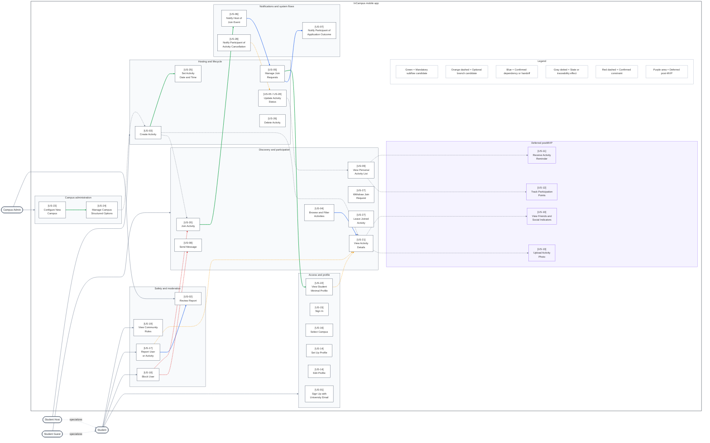

# Use Case Diagram v1.6

# InCampus Use Case Diagram - PlantUML v1.6

## Version Log

| Version | Date       | Section modified                          | Description of change                                                                                                                                                      | Reason for change                                                                                                                       | Source document                           |
| ------- | ---------- | ----------------------------------------- | -------------------------------------------------------------------------------------------------------------------------------------------------------------------------- | --------------------------------------------------------------------------------------------------------------------------------------- | ----------------------------------------- |
| 1.4     | 2026-05-06 | Hosting and lifecycle                     | Removed the standalone `Set Activity Date and Time` use case from the diagram; date and time are treated as part of `Create Activity`.                                     | The workdoc states that US-25 is no longer part of the diagram because its scope is included in the activity creation flow.             | Use cases workdoc                         |
| 1.5     | 2026-05-06 | Notifications and system flows            | Moved `Receive Activity Reminder` from the deferred postMVP section into the Notifications and system flows package.                                                       | The updated diagram note requires the reminder to be represented in the notification section rather than as a deferred item.            | Use cases workdoc; Use cases v1.1         |
| 1.5     | 2026-05-06 | Access and profile; Campus administration | Added `Update Campus Insight Consent` and `View Consent-Based Student Insights`.                                                                                           | The updated use case table introduces consent-based student insight sharing and the corresponding campus-admin insight access use case. | Use cases v1.1                            |
| 1.5     | 2026-05-06 | Deferred postMVP; Safety constraints      | Added `Send Message` as a deferred postMVP use case and restored the `Block User` constraint toward it.                                                                    | The use case inventory includes `Send Message`, and the relationship review confirms that blocking constrains messaging.                | Use cases v1.1; use-case-relationships.md |
| 1.5     | 2026-05-06 | Relationship notation                     | Distinguished formal include/extend relations from triggers, handoffs, state dependencies, and constraints.                                                                | Several existing relationships are real dependencies but should not all be interpreted as UML `include` relationships.                  | use-case-relationships.md                 |
| 1.6     | 2026-05-06 | Deferred postMVP package                  | Removed the `Deferred postMVP` package and all use cases marked as `<<Deferred>>` or postMVP.                                                                              | The diagram must show only current non-deferred use cases and avoid clutter from out-of-scope future functionality.                     | Current PlantUML diagram; Use cases v1.1  |
| 1.6     | 2026-05-06 | Layout links                              | Removed all hidden layout links such as `-[hidden]-` and `-[hidden]down-`.                                                                                                 | Hidden links are artificial layout constraints and should not appear in a clean UML use case diagram source.                            | Current PlantUML diagram                  |
| 1.6     | 2026-05-06 | Use case relationships                    | Removed generic trigger, handoff, navigation, state, traceability, and constraint arrows between use cases; kept only formal `<<include>>` and `<<extend>>` relationships. | The diagram must represent only meaningful UML use case relationships, not implementation dependencies or workflow consequences.        | use-case-relationships.md                 |
| 1.6     | 2026-05-06 | Actor associations                        | Replaced package-level actor links with simple actor-to-use-case associations.                                                                                             | Actor associations should remain explicit and UML-readable without non-standard package-level shortcuts.                                | Current PlantUML diagram; Use cases v1.1  |

## Complete PlantUML Code

```
@startuml InCampusUseCaseRelationshipsV3
title InCampus Use Case Relationships

left to right direction

skinparam shadowing false
skinparam packageStyle rectangle
skinparam linetype ortho
skinparam dpi 200
skinparam defaultFontName Helvetica
skinparam wrapWidth 170

skinparam nodesep 110
skinparam ranksep 140
skinparam padding 10
skinparam packagePadding 24
skinparam rectanglePadding 26

skinparam ArrowColor #CBD5E1
skinparam ArrowThickness 1
skinparam ArrowFontColor #475569
skinparam ArrowFontSize 12

skinparam actor {
  BorderColor #334155
  BackgroundColor #F8FAFC
  FontColor #0F172A
}

skinparam rectangle {
  BorderColor #1F2937
  BackgroundColor #F8FAFC
}

skinparam package {
  BorderColor #475569
  BackgroundColor #FFFFFF
  FontColor #0F172A
}

skinparam usecase {
  BorderColor #334155
  BackgroundColor #FFFFFF
  FontColor #111827
}

actor Student
actor "Student\nHost" as Host
actor "Student\nGuest" as Guest
actor "Campus\nAdmin" as Admin

Host -[#CBD5E1]-|> Student
Guest -[#CBD5E1]-|> Student

rectangle "InCampus mobile app" {
  package "Access and profile" as PKG_Access {
    usecase "[US-01]\nSign Up with\nUniversity Email" as UC_SignUp
    usecase "[US-15]\nSign In" as UC_SignIn
    usecase "[US-16]\nSelect Campus" as UC_SelectCampus
    usecase "[US-14]\nSet Up Profile" as UC_SetUpProfile
    usecase "[US-14]\nEdit Profile" as UC_EditProfile
    usecase "[US-22]\nView Student\nMinimal Profile" as UC_ViewProfile

    UC_SignUp -[hidden]down- UC_SignIn
    UC_SignIn -[hidden]down- UC_SelectCampus
    UC_SelectCampus -[hidden]down- UC_SetUpProfile
    UC_SetUpProfile -[hidden]down- UC_EditProfile
    UC_EditProfile -[hidden]down- UC_ViewProfile
  }

  package "Discovery and participation" as PKG_Discovery {
    usecase "[US-04]\nBrowse and Filter\nActivities" as UC_Browse
    usecase "[US-21]\nView Activity\nDetails" as UC_ViewDetails
    usecase "[US-20]\nJoin Activity" as UC_Join
    usecase "[US-27]\nWithdraw Join\nRequest" as UC_Withdraw
    usecase "[US-27]\nLeave Joined\nActivity" as UC_Leave
    usecase "[US-09]\nView Personal\nActivity List" as UC_PersonalList

    UC_Browse -[hidden]down- UC_ViewDetails
    UC_ViewDetails -[hidden]down- UC_Join
    UC_Join -[hidden]down- UC_Withdraw
    UC_Withdraw -[hidden]down- UC_Leave
    UC_Leave -[hidden]down- UC_PersonalList
  }

  package "Hosting and lifecycle" as PKG_Hosting {
    usecase "[US-03]\nCreate Activity" as UC_CreateActivity
    usecase "[US-25]\nSet Activity\nDate and Time" as UC_SetDateTime
    usecase "[US-05]\nManage Join\nRequests" as UC_ManageRequests
    usecase "[US-05 / US-28]\nUpdate Activity\nStatus" as UC_UpdateStatus
    usecase "[US-26]\nDelete Activity" as UC_DeleteActivity

    UC_CreateActivity -[hidden]down- UC_SetDateTime
    UC_SetDateTime -[hidden]down- UC_ManageRequests
    UC_ManageRequests -[hidden]down- UC_UpdateStatus
    UC_UpdateStatus -[hidden]down- UC_DeleteActivity
  }

  package "Notifications and system flows" as PKG_Notify {
    usecase "[US-06]\nNotify Host of\nJoin Event" as UC_NotifyHost
    usecase "[US-07]\nNotify Participant of\nApplication Outcome" as UC_NotifyOutcome
    usecase "[US-28]\nNotify Participant of\nActivity Cancellation" as UC_NotifyCancellation

    UC_NotifyHost -[hidden]down- UC_NotifyOutcome
    UC_NotifyOutcome -[hidden]down- UC_NotifyCancellation
  }

  package "Safety and moderation" as PKG_Safety {
    usecase "[US-19]\nView Community\nRules" as UC_ViewRules
    usecase "[US-17]\nReport User\nor Activity" as UC_Report
    usecase "[US-18]\nBlock User" as UC_Block
    usecase "[US-02]\nReview Report" as UC_ReviewReport

    UC_ViewRules -[hidden]down- UC_Report
    UC_Report -[hidden]down- UC_Block
    UC_Block -[hidden]down- UC_ReviewReport
  }

  package "Campus administration" as PKG_Admin {
    usecase "[US-23]\nConfigure New\nCampus" as UC_ConfigureCampus
    usecase "[US-24]\nManage Campus\nStructured Options" as UC_ManageOptions

    UC_ConfigureCampus -[hidden]down- UC_ManageOptions
  }

  PKG_Access -[hidden]right- PKG_Discovery
  PKG_Discovery -[hidden]right- PKG_Hosting
  PKG_Hosting -[hidden]right- PKG_Notify
  PKG_Discovery -[hidden]down- PKG_Safety
  PKG_Notify -[hidden]down- PKG_Admin
  PKG_Safety -[hidden]right- PKG_Admin
}

' Actor to Package relationships
Student -[#CBD5E1]-> PKG_Access
Guest -[#CBD5E1]-> PKG_Discovery
Host -[#CBD5E1]-> PKG_Hosting
Admin -[#CBD5E1]-> PKG_Admin

' Safety and Moderation has mixed actors
Student -[#CBD5E1]-> UC_ViewRules
Student -[#CBD5E1]-> UC_Report
Student -[#CBD5E1]-> UC_Block
Admin -[#CBD5E1]-> UC_ReviewReport

' --- Unified relationships ---
UC_ConfigureCampus -[#86EFAC,thickness=2]-> UC_ManageOptions
UC_CreateActivity -[#86EFAC,thickness=2]-> UC_SetDateTime 
UC_Join -[#86EFAC,thickness=2]-> UC_NotifyHost
UC_ManageRequests -[#86EFAC,thickness=2]-> UC_ViewProfile 

UC_ViewProfile -[#FDE047,dotted,thickness=2]-> UC_ViewDetails 
UC_Report -[#FDE047,dotted,thickness=2]-> UC_ViewDetails 
UC_NotifyCancellation -[#FDE047,dotted,thickness=2]-> UC_UpdateStatus

UC_Browse -[#86EFAC,thickness=2]-> UC_ViewDetails 

UC_NotifyHost -[#86EFAC,thickness=2]-> UC_ManageRequests
UC_ManageRequests -[#86EFAC,thickness=2]-> UC_NotifyOutcome
UC_Report -[#86EFAC,thickness=2]-> UC_ReviewReport 

UC_ManageOptions -[#86EFAC,thickness=2]-> UC_CreateActivity
UC_CreateActivity -[#86EFAC,thickness=2]-> UC_ViewDetails
UC_CreateActivity -[#86EFAC,thickness=2]-> UC_Join
UC_UpdateStatus -[#86EFAC,thickness=2]-> UC_PersonalList

UC_Block -[#86EFAC,thickness=2]-> UC_Join


legend right
<b>Visual key</b>

<color:#86EFAC><b>Light green arrow</b></color> — Include
<color:#FDE047><b>Dotted yellow arrow</b></color> — Extend
endlegend

@enduml

```

## Use case diagram (v1.4)


notes: US-25 set activity date and time is no more part of the diagram, its scope is included in create activity. to add Receive Activity reminder in the notification section

## Use case diagram (v1.1)


