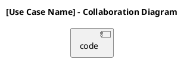

# Collaboration Diagram workDoc v1.1

# W9 Collaboration Diagrams WorkDoc v1.1

## Version Log

| Version | Date | Diagram | Change | Reason | Source |
|---|---|---|---|---|---|
| 1.1 | 2026-05-08 | Collaboration diagram working rules | Added final pre-skeleton alignment rules for accepted decisions, admin insight MVP handling, runtime admin authorization, notification boundaries, and source-priority limits. | Required before using collaboration diagrams as input for the first code architecture skeleton. | Final documentation review + team decisions 2026-05-08 |

## 1. Purpose

This folder is for **collaboration diagrams derived from the existing sequence diagrams** and for the explicitly accepted MVP collaboration diagram added during the final pre-skeleton pass.

A collaboration diagram shows how the same objects involved in a sequence diagram communicate with each other, but with stronger focus on:

* object links;
* message flow;
* numbered interactions;
* responsibility distribution between boundary, control/service, module, repository, and data store objects.

The goal is simple: each teammate must transform the assigned sequence diagrams into clear UML collaboration diagrams without changing the original use case logic.

This work does **not** include:

* new use case narratives;
* new requirements;
* new actors;
* new data stores;
* new system behavior;
* changes to the original sequence diagram logic.

Exception for this final pass: `DUC-CA-03 — View Consent-Based Student Insights` is an accepted MVP use case and may be added as a concise collaboration diagram if no earlier collaboration source exists. This exception must not introduce a new data store.

***

## 2. Working Methodology

Each collaboration diagram must be created from an already approved or drafted sequence diagram, unless the final pre-skeleton decisions explicitly require the missing Admin Insights collaboration view.

The teammate responsible for a sequence diagram is also responsible for the related collaboration diagram.

The work process is:

1. Start from the existing sequence diagram.
2. Keep the same actors, boundary objects, services/modules, repositories, data stores, and events.
3. Convert vertical time-based messages into numbered object-to-object messages.
4. Preserve the same order of operations using message numbers.
5. Keep store access consistent with the CRUD Matrix.
6. Keep cross-subsystem responsibilities unchanged.
7. Mark unclear points explicitly instead of silently changing the logic.

Do not redesign the use case while creating the collaboration diagram.

For this final pass, collaboration diagrams must also preserve these accepted decisions:

* No canonical Campus Admin store exists. Campus-admin flows use `AuthenticatedAdminContext` as a runtime/admin-auth context, not as a database.
* `DS-AP-002 Student Profile` is the canonical store name. "Minimal public profile data" is descriptive only.
* Participation uses `RecordType = request | participation` and `Status = pending | confirmed | declined`.
* Pending request withdrawal creates no user-facing notification, no NSF handler, and no `DS-NS-001` record.
* `Submit Report` does not read `DS-HL-001`; `Review Report` may read activity context from `DS-HL-001`.
* SM records moderation decisions but delegates AP/H&L consequences to native AP/H&L workflows.
* `ModerationAction = none | warn_user | suspend_user | ban_user | remove_activity`.
* NSF alone creates `DS-NS-001`; opening notifications is read-only and has no read/unread state in the first skeleton.
* Candidate service, API, and event names in diagrams are scaffolding unless marked as accepted first-skeleton internal contracts.

***

## 3. What the Collaboration Diagram Must Show

Each collaboration diagram must show:

```
Actor
→ Boundary object / screen
→ Controller or service
→ Responsible module
→ Repository / data store
→ Event dispatcher or notification module, only if relevant
```

Messages must be numbered clearly.

Example:

```
1: submit join request(activityId, studentId)
2: read activity context(activityId)
3: check existing participation(activityId, studentId)
4: check block relation(studentId, hostId)
5: create participation record(...)
6: emit notification-relevant event(...)
```

Use precise object names.

Avoid vague names such as:

```
System
Manager
Handler
Processor
Database
```

Prefer specific names such as:

```
ActivityDetailsScreen
JoinActivityController
ParticipationService
ActivityRepository
ParticipationRepository
BlockRelationshipRepository
NotificationTriggerService
```

***

## 4. Collaboration Diagram Page Template

Each collaboration diagram page must use this format.

````markdown
# [Use Case Name] — Collaboration Diagram

## Purpose

[One short paragraph explaining which sequence diagram this collaboration diagram is derived from and what interaction it represents.]

## Source Sequence Diagram

- [Name of the related sequence diagram]

## Related Use Case Realization

- DUC-...

## Related Requirements

FR: [...]
NFR: [...]

## Participants / Objects

| Object | Type | Responsibility |
|---|---|---|
| [Actor] | Actor | Initiates the use case |
| [ScreenName] | Boundary | Collects input and displays output |
| [ControllerName] | Control | Coordinates the interaction |
| [ServiceName] | Service | Applies domain logic |
| [RepositoryName] | Repository | Reads/writes persistent data |
| [Store ID] | Data Store | Stores persistent business data |
| [EventName] | Event | Represents an internal event, if relevant |

## Message Sequence

| No. | Source | Destination | Message |
|---|---|---|---|
| 1 | Actor | Boundary | [message] |
| 2 | Boundary | Controller | [message] |
| 3 | Controller | Service | [message] |
| 4 | Service | Repository/Data Store | [message] |

## PlantUML Code



## Notes for Review

- [Important modeling decision.]
- [Open point, if any.]
````

***

## 5. WorkDoc Obligation

Each subgroup folder must maintain an updated **Collaboration Diagram WorkDoc**.

The WorkDoc is mandatory because it guarantees:

* traceability from sequence diagrams to collaboration diagrams;
* alignment with Use Case Realizations;
* consistency with the CRUD Matrix;
* continuity if another teammate needs to review or continue the work;
* clear documentation of assumptions, unresolved points, and design decisions.

The WorkDoc must include:

```markdown
# Collaboration Diagram WorkDoc — [Name / Assigned Subsystems]

## Version Log

| Version | Date | Diagram | Change | Reason | Source |
|---|---|---|---|---|---|
| 1.0 | YYYY-MM-DD | [Diagram name] | Initial collaboration diagram draft. | Derived from existing sequence diagram. | Sequence Diagram + Use Case Realization + CRUD Matrix |

## Assigned Subsystems

- [Subsystem 1]
- [Subsystem 2]

## Source Sequence Diagrams

| Sequence Diagram | Related Collaboration Diagram | Status | Notes |
|---|---|---|---|
| [Sequence diagram name] | [Collaboration diagram name] | Draft / Reviewed / Final | [short note] |

## Cross-Subsystem Notes

Write any dependency with other subsystems here.

Example:
- Join Activity emits an event consumed by NSF.
- Report Review may trigger AP/H&L native workflows.
- Notification suppression depends on SM block relationships.

## Open Points

- None.

or:

- Unresolved: ...
- Assumption for modeling only: ...
- Future extension: ...
- Out of MVP: ...
```

***

## 6. Review Rules

Before submitting, each teammate must check:

1. The collaboration diagram is derived from an existing sequence diagram.
2. The same objects and responsibilities are preserved.
3. Message numbering is clear and follows the original sequence logic.
4. No new actor, store, module, or behavior is invented.
5. Every data-store access matches the CRUD Matrix.
6. Cross-subsystem ownership is respected.
7. Open points are explicitly documented in the WorkDoc.
8. The diagram is readable and compact enough to support the final report.

***

## 7. Final Submission Expected from Each Teammate

Each teammate submits:

```
1 Collaboration Diagram WorkDoc
Collaboration diagrams derived from the assigned sequence diagrams
PlantUML code for each diagram
Rendered diagram image, if available
```

The output must be compact, traceable, and directly aligned with the existing sequence diagram work.
