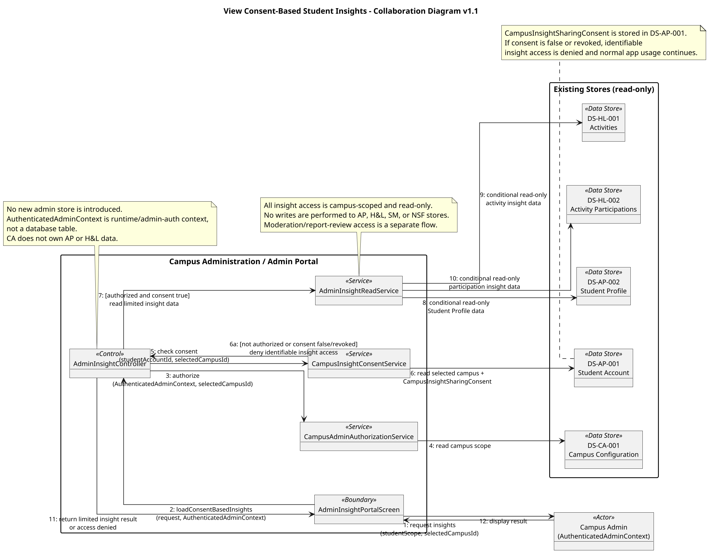

# View Consent-Based Student Insights — Collaboration Diagram v1.1

## Version Log

| Version | Date | Diagram | Change | Reason | Source |
|---|---|---|---|---|---|
| 1.1 | 2026-05-08 | View Consent-Based Student Insights | Added missing MVP collaboration view for consent-gated, campus-scoped, read-only Admin Insights over existing stores. | Admin Insights are MVP and must be represented before the first code architecture skeleton. | Final documentation review + team decisions 2026-05-08 |

## Purpose

This collaboration diagram represents `DUC-CA-03 — View Consent-Based Student Insights`, which was confirmed as an MVP capability during the final pre-skeleton review. No earlier collaboration diagram source was found, so this concise source is added for skeleton readiness. It shows Campus Admin access through an admin-only portal, runtime authorization through `AuthenticatedAdminContext`, consent checks in `DS-AP-001 Student Account`, and conditional read-only insight access over existing AP and H&L stores.

## Source Sequence Diagram

* No existing source sequence diagram was found in the collaboration diagram package.
* Added from accepted final team decision `DUC-CA-03 — View Consent-Based Student Insights`.

## Related Use Case Realization

* DUC-CA-03 — View Consent-Based Student Insights

## Related Requirements

FR: Admin Insights MVP, consent-based campus-scoped student insight access

NFR: privacy, authorization, campus scoping, least-privilege access

## Participants / Objects

| Object | Type | Responsibility |
|---|---|---|
| Campus Admin | Actor | Requests insight data from an admin-only portal through `AuthenticatedAdminContext`. |
| AdminInsightPortalScreen | Boundary | Collects insight request parameters and displays limited result or denial. |
| AdminInsightController | Control | Coordinates authorization, consent checks, and read-only insight query. |
| CampusAdminAuthorizationService | Service | Verifies runtime `AuthenticatedAdminContext` and campus scope. |
| CampusInsightConsentService | Service | Checks `CampusInsightSharingConsent` on the student account. |
| AdminInsightReadService | Service | Performs conditional read-only access to allowed stores. |
| DS-CA-001 Campus Configuration | Data Store | Campus scope source; read-only in this flow. |
| DS-AP-001 Student Account | Data Store | Stores selected campus and `CampusInsightSharingConsent`; read-only in this flow. |
| DS-AP-002 Student Profile | Data Store | Student Profile data; read-only only when authorized and consent is valid. |
| DS-HL-001 Activities | Data Store | Activity insight data; read-only only when authorized and consent is valid. |
| DS-HL-002 Activity Participations | Data Store | Participation insight data; read-only only when authorized and consent is valid. |

## Message Sequence

| No. | Source | Destination | Message |
|---|---|---|---|
| 1 | Campus Admin | AdminInsightPortalScreen | request insights(studentScope, selectedCampusId) |
| 2 | AdminInsightPortalScreen | AdminInsightController | loadConsentBasedInsights(request, `AuthenticatedAdminContext`) |
| 3 | AdminInsightController | CampusAdminAuthorizationService | authorize(`AuthenticatedAdminContext`, selectedCampusId) |
| 4 | CampusAdminAuthorizationService | DS-CA-001 Campus Configuration | read campus scope |
| 5 | AdminInsightController | CampusInsightConsentService | check consent(studentAccountId, selectedCampusId) |
| 6 | CampusInsightConsentService | DS-AP-001 Student Account | read selected campus and `CampusInsightSharingConsent` |
| 6a | CampusInsightConsentService | AdminInsightController | [not authorized or consent false/revoked] deny identifiable insight access |
| 7 | AdminInsightController | AdminInsightReadService | [authorized and consent true] read limited insight data |
| 8 | AdminInsightReadService | DS-AP-002 Student Profile | conditional read-only Student Profile data |
| 9 | AdminInsightReadService | DS-HL-001 Activities | conditional read-only activity insight data |
| 10 | AdminInsightReadService | DS-HL-002 Activity Participations | conditional read-only participation insight data |
| 11 | AdminInsightController | AdminInsightPortalScreen | return limited insight result or access denied |
| 12 | AdminInsightPortalScreen | Campus Admin | display result |

## PlantUML Code

## Notes for Review

* This is a new collaboration source because Admin Insights are confirmed MVP and no earlier collaboration diagram source was found in the package.
* `AuthenticatedAdminContext` is a runtime context object with `adminId`, `email`, `role`, `authorizedCampusIds`, and `selectedCampusId`; it is not a canonical data store.
* The flow uses only existing stores: `DS-CA-001`, `DS-AP-001`, `DS-AP-002 Student Profile`, `DS-HL-001`, and `DS-HL-002`.
* CA does not own AP/H&L data and performs no AP/H&L writes.
* Consent false/revoked denies identifiable insight access but does not block normal student app usage.
* Exact insight aggregation shape and UI copy remain unresolved.
