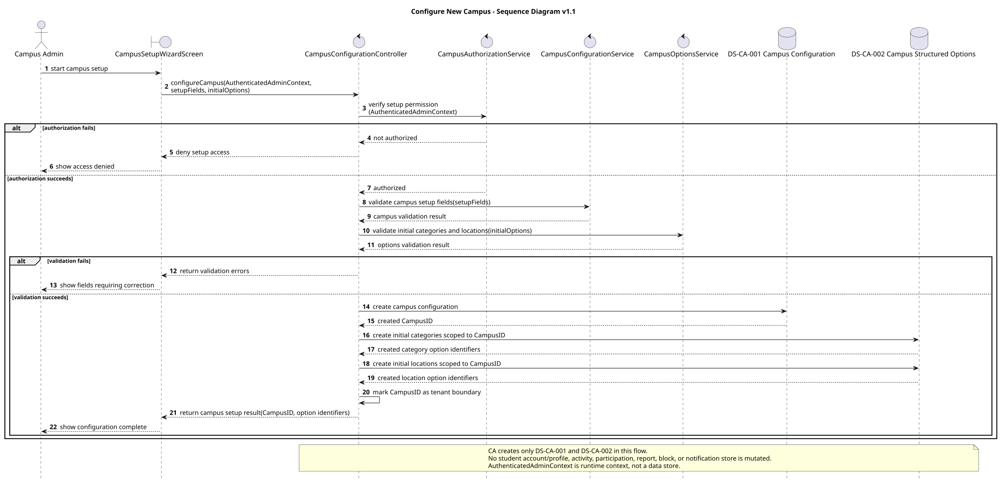
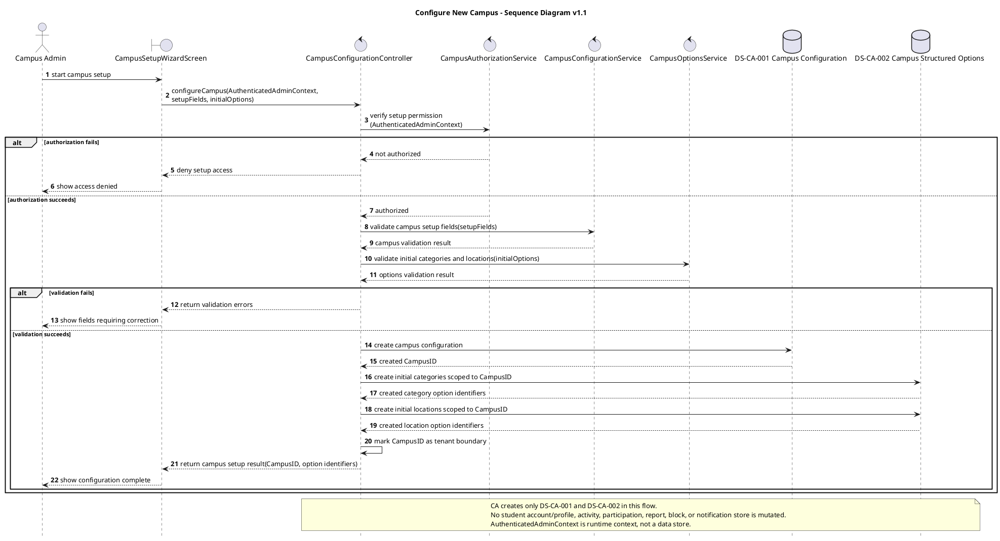

# Configure New Campus Sequence Diagram v1.1

# Configure New Campus — Sequence Diagram v1.1

## Version Log

| Version | Date | Diagram | Change | Reason | Source |
|---|---|---|---|---|---|
| 1.1 | 2026-05-08 | Configure New Campus | Reframed admin authorization through runtime `AuthenticatedAdminContext`, preserved CA-only writes to `DS-CA-001` and `DS-CA-002`, and clarified no admin store. | Required before first code architecture skeleton. | Final documentation review + team decisions 2026-05-08 |

## Purpose

This sequence diagram shows how Campus Administration lets an authorized campus admin configure a new campus, create the campus tenant boundary, and seed the first campus-specific categories and locations without mutating downstream student account/profile, activity, moderation, or notification stores. Admin identity is represented as runtime `AuthenticatedAdminContext`, not as a canonical Campus Admin store.

## Related Use Case Realization

* DUC-CA-01 — Configure New Campus

## Related Requirements

FR: \[FR-2301, FR-2302]
NFR: \[NFR-37, NFR-38]

## Participants

| Participant                         | Type       | Responsibility                                                             |
| ----------------------------------- | ---------- | -------------------------------------------------------------------------- |
| Campus Admin                        | Actor      | Starts and confirms the guided campus setup workflow through `AuthenticatedAdminContext`. |
| CampusSetupWizardScreen             | Boundary   | Captures campus setup fields and initial structured options.               |
| CampusConfigurationController       | Control    | Coordinates the configure-new-campus use case inside CA.                   |
| CampusAuthorizationService          | Service    | Verifies runtime `AuthenticatedAdminContext` and campus setup permission.  |
| CampusConfigurationService          | Service    | Validates campus setup fields and prepares the campus record.              |
| CampusOptionsService                | Service    | Validates and prepares initial categories and locations or meeting points. |
| DS-CA-001 Campus Configuration      | Data Store | Stores the created campus record and generated CampusID.                   |
| DS-CA-002 Campus Structured Options | Data Store | Stores initial campus-scoped category and location option records.         |

## Main Sequence Logic

1. The campus admin starts guided setup from `CampusSetupWizardScreen`.
2. `CampusConfigurationController` coordinates the request and asks `CampusAuthorizationService` to verify setup permission from runtime `AuthenticatedAdminContext`.
3. If authorization fails, no campus or option record is created.
4. If authorization succeeds, `CampusConfigurationService` validates the known setup fields.
5. `CampusOptionsService` validates initial campus-specific categories and locations or meeting points.
6. If validation fails, no campus or option record is created.
7. If validation succeeds, CA creates `DS-CA-001 Campus Configuration` and receives the generated `CampusID`.
8. CA creates initial `DS-CA-002 Campus Structured Options` records scoped to that `CampusID`.
9. The created `CampusID` becomes the tenant boundary and the result is returned to the campus admin.

## PlantUML Code

## Notes for Review

* `CampusID` is modeled as the tenant boundary created by the campus configuration flow.
* CA creates the campus record and initial typed option records only in CA-owned stores.
* No AP, H\&L, SM, or NSF store is created or mutated by this flow, including student account/profile stores.
* No `DS-CA-003`, Admin Account Store, or Campus Admin Store is introduced.
* Unresolved: exact campus setup fields, setup validation rules, and admin authentication implementation behind `AuthenticatedAdminContext`.
