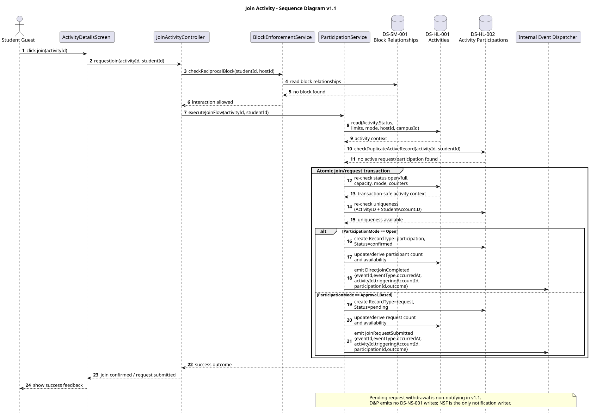
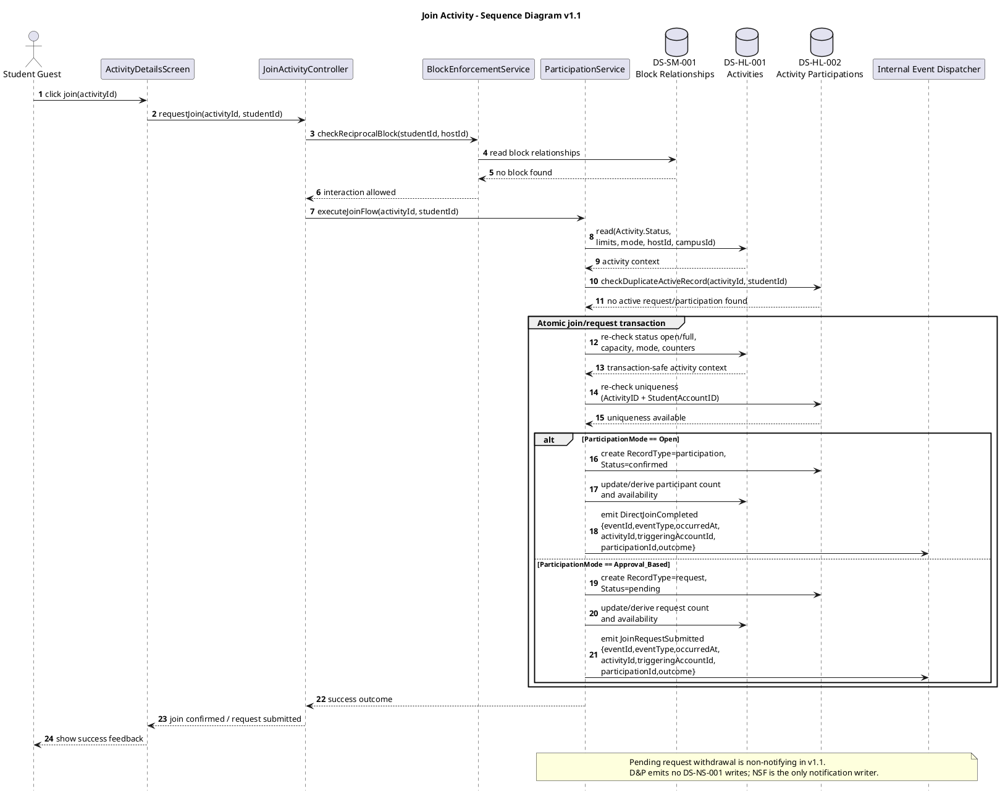

# Join Activity — Sequence Diagram v1.1

## Version Log

| Version | Date | Diagram | Change | Reason | Source |
|---|---|---|---|---|---|
| 1.1 | 2026-05-08 | Join Activity | Aligned participation records to `RecordType + Status`, added atomic join/request checks, first-skeleton event payloads, and clarified no direct notification writes. | Required before first code architecture skeleton. | Final documentation review + team decisions 2026-05-08 |

# Purpose

This sequence diagram illustrates how the Discovery and Participation (D\&P) subsystem handles a student guest attempting to join an activity. It details block checks, activity status and capacity validation, canonical participation record creation, transactional count/availability updates, and event emission for later NSF processing. D\&P never creates `DS-NS-001` notification records.

## Related Use Case Realization

* DUC-DP-03 — Join Activity

## Related Requirements

FR: FR-0305, FR-2001, FR-2002, FR-0502

NFR: NFR-13, NFR-34

## Participants

| Participant                       | Type       | Responsibility                                                      |
| --------------------------------- | ---------- | ------------------------------------------------------------------- |
| Student Guest                     | Actor      | External actor initiating the join request                          |
| ActivityDetailsScreen             | Boundary   | User-facing interface for viewing and interacting with the activity |
| JoinActivityController            | Control    | Coordinates the join use case and delegates to services             |
| BlockEnforcementService           | Service    | Verifies no reciprocal block exists between student and host        |
| ParticipationService              | Service    | Performs domain logic to validate constraints and create the record |
| DS-SM-001 Block Relationships     | Data Store | Persistent source for block relationships (Read)                    |
| DS-HL-001 Activities              | Data Store | Persistent source for activity truth and capacity (Read/Update)     |
| DS-HL-002 Activity Participations | Data Store | Persistent source for participation records (Read/Create)           |
| Internal Event Dispatcher         | Event      | Bus routing `DirectJoinCompleted` or `JoinRequestSubmitted` to NSF  |

## Main Sequence Logic

1. The student guest initiates a join request from the `ActivityDetailsScreen`.
2. `JoinActivityController` calls `BlockEnforcementService` to verify the student and host are not blocking each other via `DS-SM-001`.
3. If no block exists, the controller delegates to `ParticipationService` to execute the join.
4. `ParticipationService` reads `DS-HL-001` to check activity status, campus scope, capacity limits, and participation mode.
5. `ParticipationService` reads `DS-HL-002` to confirm the student has not already joined or requested.
6. Inside the write transaction, `ParticipationService` re-checks capacity and duplicate active request/participation state.
7. Based on `ParticipationMode`, a canonical participation record is created in `DS-HL-002`: direct join uses `RecordType = participation`, `Status = confirmed`; approval-based request uses `RecordType = request`, `Status = pending`.
8. Activity counters/availability are derived or updated transactionally in `DS-HL-001`.
9. The corresponding domain event is emitted to the `Internal Event Dispatcher` for NSF consumption using first-skeleton internal event payload fields.

## PlantUML Code

## Notes for Review

* Activity lifecycle status is `open | full | completed | cancelled`; `deleted` is not a persisted `Activity.Status`.
* Participation persistence uses `RecordType = request | participation` and `Status = pending | confirmed | declined`.
* Join/request operations that affect counters or availability are atomic. Capacity and duplicate active record state are re-checked inside the write transaction; conflicting concurrent operations receive safe rejection.
