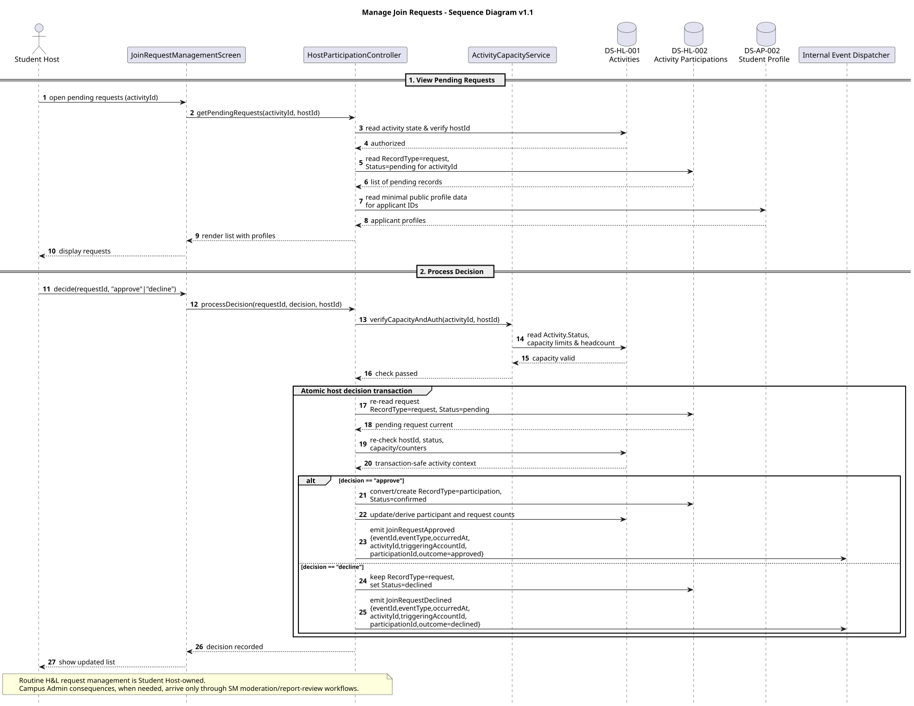
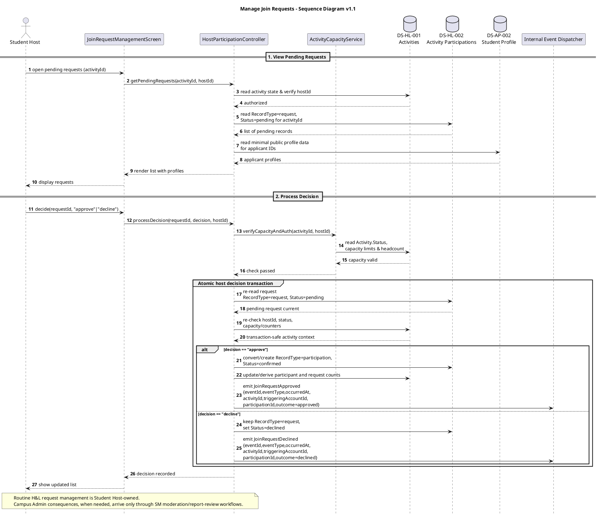

# Manage Join Requests — Sequence Diagram v1.1

## Version Log

| Version | Date | Diagram | Change | Reason | Source |
|---|---|---|---|---|---|
| 1.1 | 2026-05-08 | Manage Join Requests | Removed routine admin authority, aligned `RecordType + Status`, added atomic approval checks and accepted event payloads. | Required before first code architecture skeleton. | Final documentation review + team decisions 2026-05-08 |

# Purpose

This sequence diagram shows how the Hosting and Lifecycle (H\&L) subsystem processes a Student Host's routine interaction with pending join requests. It covers initial data retrieval, display of applicants' minimal public profile data from `DS-AP-002 Student Profile`, and atomic approval or decline decisions before emitting downstream events. Campus Admin does not own routine request decisions; moderation-triggered consequences are handled through separate SM-to-H\&L native workflows.

## Related Use Case Realization

* DUC-HL-02 — Manage Join Requests

## Related Requirements

FR: FR-0501, FR-0502, FR-2002, FR-1403

NFR: NFR-12, NFR-13

## Participants

| Participant                       | Type       | Responsibility                                                                 |
| --------------------------------- | ---------- | ------------------------------------------------------------------------------ |
| Student Host                      | Actor      | External actor reviewing pending join requests                                 |
| JoinRequestManagementScreen       | Boundary   | User-facing interface for viewing requests and applicant profiles              |
| HostParticipationController       | Control    | Coordinates request retrieval and approval/decline processing                  |
| ActivityCapacityService           | Service    | Verifies headcount constraints before allowing an approval                     |
| DS-HL-001 Activities              | Data Store | Persistent source for activity constraints and current headcount (Read/Update) |
| DS-HL-002 Activity Participations | Data Store | Persistent source for pending request records (Read/Update)                    |
| DS-AP-002 Student Profile         | Data Store | Persistent source for applicant minimal profiles (Read)                        |
| Internal Event Dispatcher         | Event      | Bus routing `JoinRequestApproved` or `JoinRequestDeclined` to NSF              |

## Main Sequence Logic

1. The student host navigates to the request management screen.
2. `HostParticipationController` queries `DS-HL-002` for records with `RecordType = request`, `Status = pending`, `DS-HL-001` for the current activity state, and `DS-AP-002` for the applicants' minimal public profile data.
3. The host submits a decision (approve or decline) for a specific request via the `JoinRequestManagementScreen`.
4. The controller checks `DS-HL-001` (via `ActivityCapacityService`) to ensure the host is authorized and that the activity's max participant limit has not been exceeded.
5. Inside the write transaction, `HostParticipationController` re-checks the request state, host authority, capacity, and duplicate active record constraints.
6. Approval represents the accepted participant as `RecordType = participation`, `Status = confirmed`; decline leaves the request with `RecordType = request`, `Status = declined`.
7. If approved, the controller derives or updates participant/request counters transactionally in `DS-HL-001`.
8. An outcome event is emitted to the `Internal Event Dispatcher` so NSF can notify the applicant.

## PlantUML Code

## Notes for Review

* Activity lifecycle status is `open | full | completed | cancelled`; `deleted` is not a persisted `Activity.Status`.
* Participation persistence uses `RecordType = request | participation` and `Status = pending | confirmed | declined`.
* Approval/decline operations are atomic and re-check request state, capacity, and host authority inside the write transaction.
