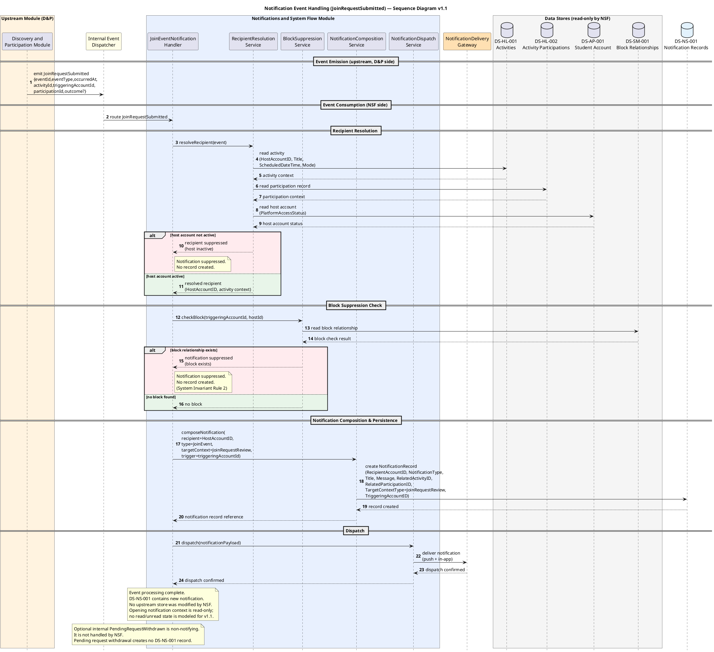

# Notification Event Handling (JoinRequestSubmitted) — Sequence Diagram v1.1

## Version Log

| Version | Date | Diagram | Change | Reason | Source |
|---|---|---|---|---|---|
| 1.1 | 2026-05-08 | Notification Event Handling (JoinRequestSubmitted) | Aligned event payload fields, NSF-only `DS-NS-001` ownership, pending-withdraw suppression, Activity Reminder MVP event note, and no read/unread state. | Required before first code architecture skeleton. | Final documentation review + team decisions 2026-05-08 |

## Purpose

This sequence diagram shows how the Notifications and System Flow module processes one notification-relevant internal domain event. The chosen event is `JoinRequestSubmitted`, emitted by Discovery and Participation when a student submits a pending join request for an approval-based activity. The diagram demonstrates the NSF pattern for event consumption, recipient resolution from upstream stores, block-based notification suppression, notification record composition and persistence in `DS-NS-001`, and dispatch through the notification delivery gateway. It does not generalize pending-request withdrawal into a notification event.

## Related Use Case Realization

* DUC-NSF-01 — Notify Host of Join Event

## Related Requirements

FR: FR-0601, FR-0602, FR-0603

NFR: NFR-14, NFR-15

## Participants

| Participant                        | Type       | Responsibility                                                                    |
| ---------------------------------- | ---------- | --------------------------------------------------------------------------------- |
| Discovery and Participation Module | Module     | Upstream emitter of the JoinRequestSubmitted event (shown as starting point only) |
| Internal Event Dispatcher          | Event      | Routes domain events between modules                                              |
| JoinEventNotificationHandler       | Control    | Consumes the event and coordinates the NSF notification flow                      |
| RecipientResolutionService         | Service    | Resolves host as recipient, validates account status                              |
| BlockSuppressionService            | Service    | Checks block state between triggering student and recipient                       |
| NotificationCompositionService     | Service    | Composes notification record from resolved context                                |
| NotificationDispatchService        | Service    | Dispatches notification to delivery gateway                                       |
| NotificationDeliveryGateway        | Gateway    | External push/in-app delivery mechanism                                           |
| DS-HL-001 Activities               | Data Store | Activity details: title, schedule, host, mode (read, owned by H\&L)               |
| DS-HL-002 Activity Participations  | Data Store | Participation/request context (read, owned by H\&L)                               |
| DS-AP-001 Student Account          | Data Store | Recipient account validity (read, owned by AP)                                    |
| DS-SM-001 Block Relationships      | Data Store | Block suppression check (read, owned by SM)                                       |
| DS-NS-001 Notification Records     | Data Store | Notification record (create, owned by NSF)                                        |

## Main Sequence Logic

1. D\&P Module emits `JoinRequestSubmitted` with the first-skeleton ordinary event payload: `eventId`, `eventType`, `occurredAt`, `activityId`, `triggeringAccountId`, `participationId`, and `outcome` when applicable.
2. Internal Event Dispatcher routes the event to JoinEventNotificationHandler in the NSF module.
3. JoinEventNotificationHandler calls RecipientResolutionService to resolve the notification recipient.
4. RecipientResolutionService reads DS-HL-001 to retrieve the activity details (HostAccountID, Title, ScheduledDateTime, ParticipationMode).
5. DS-HL-001 returns the activity context.
6. RecipientResolutionService reads DS-HL-002 to retrieve the participation record context for the event.
7. DS-HL-002 returns the participation context.
8. RecipientResolutionService reads DS-AP-001 to verify the host account is active (PlatformAccessStatus = Active).
9. DS-AP-001 returns the host account status.
10. \[alt] If host account is not active: RecipientResolutionService returns suppressed. JoinEventNotificationHandler logs suppression. Flow ends.
11. RecipientResolutionService returns the resolved recipient (HostAccountID) and activity context to JoinEventNotificationHandler.
12. JoinEventNotificationHandler calls BlockSuppressionService.
13. BlockSuppressionService reads DS-SM-001 to check whether a block relationship exists between the joining student (`triggeringAccountId` from event) and the host.
14. DS-SM-001 returns the block check result.
15. \[alt] If block relationship exists: BlockSuppressionService returns suppressed. JoinEventNotificationHandler logs suppression. Flow ends.
16. BlockSuppressionService returns no block found.
17. JoinEventNotificationHandler calls NotificationCompositionService with the resolved context.
18. NotificationCompositionService composes the notification record: RecipientAccountID = HostAccountID, NotificationType = JoinEvent, NotificationTitle and NotificationMessage include the activity identity and event type (FR-0602), RelatedActivityID = activityId, RelatedParticipationID = participationId, TargetContextType = JoinRequestReview, TriggeringAccountID = triggeringAccountId.
19. NotificationCompositionService creates the notification record in DS-NS-001.
20. DS-NS-001 confirms record created.
21. NotificationCompositionService returns the created notification reference to JoinEventNotificationHandler.
22. JoinEventNotificationHandler calls NotificationDispatchService.
23. NotificationDispatchService dispatches the notification payload to NotificationDeliveryGateway.
24. NotificationDeliveryGateway confirms dispatch.
25. NotificationDispatchService returns dispatch confirmed.
26. JoinEventNotificationHandler confirms event processing complete.

## PlantUML Code

## Notes for Review

* This diagram shows only the NSF consumption side of the event. The D\&P emission side (student initiating the join request, activity/block checks, participation record creation, event emission) is shown in Matteo's Join Activity Sequence Diagram. The two diagrams are complementary.
* NSF reads from four external stores (DS-HL-001, DS-HL-002, DS-AP-001, DS-SM-001) but never modifies them. Only DS-NS-001 is written to, and only by NSF. This is consistent with System Invariant Rule 1 (Notification Single Source of Truth) and the CRUD Matrix.
* Block suppression is enforced per System Invariant Rule 2: all cross-user notifications must be suppressed if a block relationship exists between the triggering user and the receiving user.
* The event is modeled as `JoinRequestSubmitted` (approval-based activity). For `DirectJoinCompleted` (open activity), the flow is structurally identical except that TargetContextType would be ActivityDetails instead of JoinRequestReview. Both events are consumed by the same join-event notification handling pattern.
* Active first-skeleton notification-relevant events are `DirectJoinCompleted`, `JoinRequestSubmitted`, `JoinRequestApproved`, `JoinRequestDeclined`, `JoinedParticipantLeft`, `ActivityCancelled`, and `ActivityReminderDue`. `ActivityReminderDue` uses payload fields `eventId`, `eventType`, `occurredAt`, `activityId`, `scheduledStartAt`, and `reminderThresholdMinutes`.
* Pending request withdrawal is not a user-facing notification branch in the first skeleton. If an optional internal `PendingRequestWithdrawn` event is ever emitted, it is non-notifying, has no NSF handler, and creates no `DS-NS-001` record.
* Opening a notification context remains read-only. The first skeleton does not model `read`, `unread`, `isRead`, or `readAt` on `DS-NS-001`.
* Unresolved: Exact notification delivery channel (push, in-app, or both) is not fixed. The entity catalog defaults to PushAndInApp.
* Unresolved: Notification retry/failure handling is not specified in current FRs/NFRs.
* First-skeleton internal event payload contracts are accepted scaffolding for module integration, not public API contracts.
