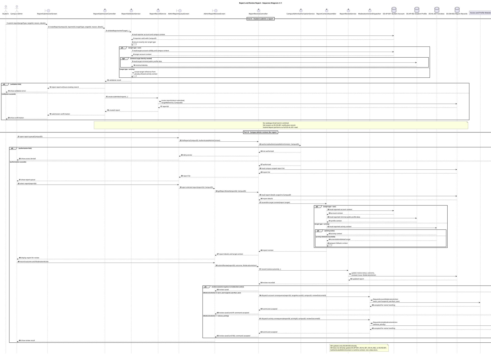

# Report and Review Report Sequence Diagram v1.1

# Report and Review Report — Sequence Diagram v1.1

## Version Log

| Version | Date | Diagram | Change | Reason | Source |
|---|---|---|---|---|---|
| 1.1 | 2026-05-08 | Report and Review Report | Removed submit-time `DS-HL-001` read, moved activity context to review, adopted `AuthenticatedAdminContext`, `Student Profile`, and `remove_activity` moderation routing. | Required before first code architecture skeleton. | Final documentation review + team decisions 2026-05-08 |

## Purpose

This sequence diagram shows how Safety and Moderation records a student report about one user or one activity, then supports campus-admin review while delegating any account or activity consequence to the owning AP or H\&L module. Submit Report stores the target reference and campus scope without a full `DS-HL-001` read; Review Report may later read activity context for admin review.

## Related Use Case Realization

* DUC-SM-02 — Report User or Activity
* DUC-SM-03 — Review Report

## Related Requirements

FR: \[FR-1701, FR-0201, FR-0202, FR-0203]
NFR: \[NFR-31, NFR-06, NFR-07, NFR-08, NFR-09]

## Participants

| Participant                       | Type        | Responsibility                                                                 |
| --------------------------------- | ----------- | ------------------------------------------------------------------------------ |
| Student                           | Actor       | Submits a report from an allowed user or activity context.                     |
| Campus Admin                      | Actor       | Reviews campus-scoped submitted reports through `AuthenticatedAdminContext`.   |
| ReportSubmissionScreen            | Boundary    | Captures the student's report target, reason, and supported details.           |
| ReportSubmissionController        | Control     | Coordinates report submission inside Safety and Moderation.                    |
| ReportValidationService           | Service     | Validates reporter, campus scope, target type, and target context.             |
| ReportRecordService               | Service     | Creates the submitted report record in the SM-owned report store.              |
| AdminReportQueueScreen            | Boundary    | Lists campus-scoped reports available to the authorized admin.                 |
| AdminReportReviewScreen           | Boundary    | Displays report details and captures the review outcome.                       |
| ReportReviewController            | Control     | Coordinates report queue access, detail viewing, and review submission.        |
| CampusAdminAuthorizationService   | Service     | Verifies runtime `AuthenticatedAdminContext` for the selected CampusID.        |
| ReportContextAssembler            | Service     | Reads target context from AP or H\&L according to report target type.          |
| ReportReviewService               | Service     | Updates only DS-SM-002 with review status, outcome, and action trace.          |
| ModerationActionDispatcher        | Service     | Sends targeted internal commands to AP or H\&L when a consequence is required. |
| DS-AP-001 Student Account         | Data Store  | Provides reporter/target account validity and campus context.                  |
| DS-AP-002 Student Profile         | Data Store  | Provides minimal public user identity only when a user target needs display context. |
| DS-HL-001 Activities              | Data Store  | Provides activity context during review when an activity target needs context. |
| DS-SM-002 Report Records          | Data Store  | Stores submitted reports and report-review outcomes.                           |
| Access and Profile Module         | Participant | Accepts account moderation commands for AP-native handling.                    |
| Hosting and Lifecycle Module      | Participant | Accepts activity moderation commands for H\&L-native handling.                 |

## Main Sequence Logic

1. The student submits a report from `ReportSubmissionScreen` with exactly one target type: user or activity.
2. `ReportSubmissionController` asks `ReportValidationService` to validate the reporter/account/profile context and target reference. Activity reports are accepted only when launched from an already allowed activity context, so submission does not perform a full `DS-HL-001` activity read.
3. `ReportRecordService` creates `DS-SM-002 Report Records` with `reviewStatus = submitted`, the target reference, and campus scope; SM emits no catalogue-level event and creates no notification record.
4. The campus admin opens the report queue for a selected `CampusID` through `AuthenticatedAdminContext`.
5. `ReportReviewController` verifies campus-admin authorization before reading campus-scoped report list/details from `DS-SM-002`.
6. `ReportContextAssembler` reads AP context for user targets or H\&L context for activity targets during review. If a referenced activity no longer exists, the admin sees an unavailable/deleted target fallback.
7. The campus admin records a review outcome and optional moderation action trace.
8. `ReportReviewService` updates only `DS-SM-002`.
9. If a native consequence is required, `ModerationActionDispatcher` sends `RequestAccountModerationAction` to AP for `warn_user`, `suspend_user`, or `ban_user`, or `RequestActivityModerationAction` to H\&L for `remove_activity`; SM does not directly update AP, H\&L, or NSF stores.

## PlantUML Code

## Notes for Review

* Report submission creates only `DS-SM-002`; no catalogue-level event or notification record is produced by SM.
* Activity reports are accepted only from already allowed activity context. Submit Report stores target reference and campus scope but does not perform a full `DS-HL-001` read.
* Review Report may read `DS-HL-001` for current activity context and displays an unavailable/deleted target fallback when the activity record no longer exists.
* Report review records decisions in `DS-SM-002` before dispatching targeted native commands to AP or H\&L.
* `ModerationAction = none | warn_user | suspend_user | ban_user | remove_activity`; `remove_activity` is recorded by SM and executed through H\&L-native workflow.
* Unresolved: evidence schema, reporter feedback, reported-party notification, and exact admin authentication implementation remain provisional.
