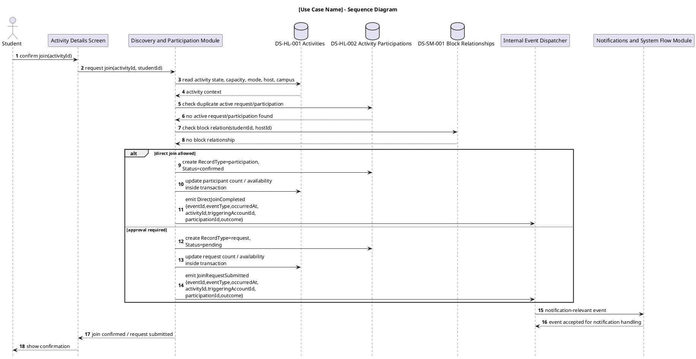

# Sequence diagram workdoc v1.1

# W9 Sequence Diagrams WorkDoc v1.1

## Version Log

| Version | Date | Diagram | Change | Reason | Source |
|---|---|---|---|---|---|
| 1.1 | 2026-05-08 | Sequence diagram workflow | Aligned source priority, provisional service/API wording, event payloads, admin context, report submit/review boundary, consent-based Admin Insights, and participation/status vocabulary. | Required before first code architecture skeleton. | Final documentation review + team decisions 2026-05-08 |

## 1. Purpose

This folder is only for **sequence diagrams derived from the Use Case Realizations**.

This work does **not** include:

* system architecture diagram;
* component diagram;
* class diagram;
* activity diagram;
* collaboration diagram;
* state chart diagram;
* new use case narratives;
* new requirements.

The goal is simple: after completing the Use Case Realization cards, each teammate must transform the most relevant realized use cases into **detailed UML sequence diagrams**.

A sequence diagram must show how the actor, boundary objects, control/services, modules, repositories/data stores, and event flows collaborate to implement one use case.

***

## 2. Folder Organization

Create the following folder:

```
W9 - System Design
└── Sequence Diagrams
    ├── 00 Sequence Diagrams Workflow WorkDoc
    ├── HL + DP
    │   ├── Sequence Diagram WorkDoc
    │   ├── Join Activity Sequence Diagram
    │   ├── Manage Join Requests Sequence Diagram
    │   └── Optional Additional Diagrams
    ├── AP + NSF
    │   ├── Sequence Diagram WorkDoc
    │   ├── Sign Up and Select Campus Sequence Diagram
    │   ├── Notification Event Handling Sequence Diagram
    │   └── Optional Additional Diagrams
    └── SM + CA
        ├── Sequence Diagram WorkDoc
        ├── Report and Review Report Sequence Diagram
        ├── Configure New Campus Sequence Diagram
        ├── View Consent-Based Student Insights Sequence Diagram
        └── Optional Additional Diagrams
```

Each teammate must keep their diagram work inside their own folder.

Each diagram must have:

1. a short **workdoc section** explaining the reasoning and version log;
2. the **PlantUML code**;
3. the rendered diagram image, if available.

***

## 3. Source Material

For this final pre-skeleton correction pass, each teammate must use this source priority:

1. Explicit final team decisions from the 2026-05-08 review/addendum;
2. Current corrected project documents in Downloads / Work;
3. Final documentation review report;
4. Older wiki baseline for structure only;
5. cautious inference, explicitly labeled.

Do not invent new actors, stores, modules, or behavior. Candidate services, APIs, commands, and events shown in sequence diagrams are scaffolding unless this workdoc marks them as first-skeleton internal contracts.

First-skeleton internal domain events:

* `DirectJoinCompleted`
* `JoinRequestSubmitted`
* `JoinRequestApproved`
* `JoinRequestDeclined`
* `JoinedParticipantLeft`
* `ActivityCancelled`
* `ActivityReminderDue`

`PendingRequestWithdrawn`, if ever mentioned, is only an optional internal non-notifying event. It has no NSF handler and creates no `DS-NS-001` record.

Ordinary activity/participation event payload fields:

* `eventId`
* `eventType`
* `occurredAt`
* `activityId`
* `triggeringAccountId`
* `participationId`, when applicable
* `outcome`, when applicable

`ActivityReminderDue` payload fields:

* `eventId`
* `eventType`
* `occurredAt`
* `activityId`
* `scheduledStartAt`
* `reminderThresholdMinutes`

Campus Admin identity is represented by runtime `AuthenticatedAdminContext` (`adminId`, `email`, `role`, `authorizedCampusIds`, `selectedCampusId`). It is not a canonical data store.

If something is unclear, mark it as:

```
Unresolved
Assumption for modeling only
Future extension
Out of MVP
```

***

## 4. What the Sequence Diagram Must Show

Each sequence diagram must show the internal realization of one use case.

It should include, when relevant:

```
Actor
→ Boundary object / screen
→ Controller or service
→ Responsible module
→ Repository / data store
→ Event publisher or notification module
→ External gateway, only if relevant
```

Use the objects already identified in the Use Case Realization card.

Do not use vague objects such as:

```
System
Manager
Handler
Processor
Database
```

Prefer precise names such as:

```
ActivityDetailsScreen
JoinActivityController
ParticipationService
BlockEnforcementService
ActivityRepository
ParticipationRepository
NotificationTriggerService
NotificationDeliveryGateway
```

***

## 5. Required Diagrams by Teammate

## Matteo - Hosting and Lifecycle + Discovery and Participation

### Mandatory diagrams

#### 1. Join Activity Sequence Diagram

This is the most important sequence diagram of the project.

It must show:

* Student Guest starts from ActivityDetailsScreen;
* join/request action is coordinated by JoinActivityController;
* DS-HL-001 Activities is read for activity status, capacity, participation mode, host reference, and campus scope;
* DS-HL-002 Activity Participations is read to prevent duplicate participation/request;
* DS-SM-001 Block Relationships is read to prevent blocked interaction;
* DS-HL-002 is created/updated with `RecordType=participation, Status=confirmed` for direct joins or `RecordType=request, Status=pending` for approval requests;
* DS-HL-001 is updated for count/availability effects;
* D\&P emits `DirectJoinCompleted` or `JoinRequestSubmitted` with the first-skeleton internal event payload fields;
* NSF later consumes the event and creates the notification record;
* D\&P must not directly create DS-NS-001 Notification Records.
* join/request changes are atomic: capacity and duplicate active request/participation state must be re-checked inside the write transaction.

#### 2. Manage Join Requests Sequence Diagram

It must show:

* Student Host opens pending requests;
* host decision is handled by RequestManagementController or equivalent;
* DS-HL-002 is read for pending requests;
* DS-HL-001 is read for activity constraints and current state;
* DS-AP-002 Student Profile is read for applicant minimal public profile display;
* DS-HL-002 is updated using `RecordType + Status`: approval yields `RecordType=participation, Status=confirmed`; decline keeps a request record with `Status=declined`;
* DS-HL-001 is updated if availability/headcount changes;
* H\&L emits `JoinRequestApproved` or `JoinRequestDeclined` with first-skeleton internal event payload fields;
* NSF consumes the event and creates participant notification if allowed.
* Student Host owns routine request decisions; Campus Admin may trigger H\&L-native consequences only through moderation/report-review flows.

### Optional diagrams

* Create Activity Sequence Diagram
* Leave Joined Activity Sequence Diagram
* Withdraw Join Request Sequence Diagram
* Update Activity Status / Cancel Activity Sequence Diagram

If a Withdraw Join Request diagram is later produced, it must show no user-facing notification branch, no NSF handler, and no `DS-NS-001` record for pending-request withdrawal.

***

## Jacopo - Access and Profile + Notifications and System Flow

### Mandatory diagrams

#### 1. Sign Up and Select Campus Sequence Diagram

It must show:

* Student enters university email and password through SignUpScreen;
* SignUpController reads DS-AP-003 University Identity Rules;
* DS-AP-001 Student Account is created/updated for verification and activation state;
* system presents campus options from DS-CA-001 Campus Configuration;
* selected CampusID is stored on DS-AP-001 Student Account;
* `CampusInsightSharingConsent` may be collected or updated during onboarding/registration or account/profile settings and is stored on DS-AP-001 Student Account;
* profile setup creates DS-AP-002 Student Profile;
* campus scope is established before campus-scoped app usage; consent refusal/revocation does not block normal app usage.

#### 2. Notification Event Handling Sequence Diagram

This diagram should show one generic notification-relevant event, preferably `JoinRequestSubmitted` or `JoinRequestApproved`.

It must show:

* NSF receives or detects an upstream event;
* NSF reads DS-AP-001 for recipient account validity;
* NSF reads DS-HL-001 and DS-HL-002 for activity/participation context;
* NSF reads DS-SM-001 Block Relationships for notification suppression;
* NSF creates DS-NS-001 Notification Record only if allowed;
* NSF sends payload to NotificationDeliveryGateway;
* NSF must not create or modify activity, participation, profile, report, or block truth.
* opening notification context, if diagrammed, is read-only and must not update read/unread state in DS-NS-001.

### Optional diagrams

* Open Notification Context Sequence Diagram
* Set Up / Edit Profile Sequence Diagram
* Sign In Sequence Diagram

***

## Francesco - Safety and Moderation + Campus Administration

### Mandatory diagrams

#### 1. Report and Review Report Sequence Diagram

It must show:

* Student submits report from ReportSubmissionScreen;
* ReportController validates reporter and target context;
* DS-AP-001 Student Account is read for reporter/target validity;
* DS-AP-002 Student Profile is read if target is a user;
* Submit Report stores target reference and campus scope without a full DS-HL-001 read; activity reports are accepted only from already allowed activity context;
* DS-SM-002 Report Records is created;
* Campus Admin opens AdminReportReviewScreen through `AuthenticatedAdminContext`;
* DS-SM-002 is read and updated with review outcome;
* Review Report may read DS-HL-001 for current activity context and shows an unavailable/deleted fallback if the target no longer exists;
* if moderation consequence is required, SM triggers native AP/H\&L workflow;
* SM must not directly ban accounts or delete activities unless modeled through the appropriate native workflow.

#### 2. Configure New Campus Sequence Diagram

It must show:

* Campus Admin starts configuration from AdminCampusConfigurationScreen;
* admin authorization is checked through runtime `AuthenticatedAdminContext`;
* CampusAdministrationController creates DS-CA-001 Campus Configuration;
* initial structured options are created in DS-CA-002 Campus Structured Options;
* CampusID is created as the tenant boundary;
* no student account, activity, participation, report, or notification record is created by this flow.

#### 3. View Consent-Based Student Insights Sequence Diagram

It must show:

* Campus Admin accesses an admin-only portal/interface using runtime `AuthenticatedAdminContext`;
* CA/Admin Insight process checks campus authorization against `authorizedCampusIds` and `selectedCampusId`;
* CA/Admin Insight process checks `CampusInsightSharingConsent` in `DS-AP-001`;
* if authorization and consent are valid, it conditionally performs read-only access to `DS-AP-002 Student Profile`, `DS-HL-001 Activities`, and `DS-HL-002 Activity Participations`;
* if consent is false or revoked, identifiable insight access is denied;
* no AP/H\&L stores are written;
* no `DS-CA-003`, Campus Admin Store, or Admin Account Store is introduced.

### Optional diagrams

* Manage Campus Structured Options Sequence Diagram
* Block User Sequence Diagram

***

## 6. WorkDoc Template for Each Teammate Folder

Each teammate must create one page called:

```
Sequence Diagram WorkDoc
```

Use this format.

```markdown
# Sequence Diagram WorkDoc — [Name / Assigned Subsystems]

## Version Log

| Version | Date | Diagram | Change | Reason | Source |
|---|---|---|---|---|---|
| 1.0 | YYYY-MM-DD | [Diagram name] | Initial sequence diagram draft. | First design translation from use case realization. | Use Case Realization + CRUD Matrix |

## Assigned Subsystems

- [Subsystem 1]
- [Subsystem 2]

## Diagrams Produced

| Diagram | Related Use Case | Status | Notes |
|---|---|---|---|
| [Diagram name] | [Use case] | Draft / Reviewed / Final | [short note] |

## Cross-Subsystem Notes

Write any dependency with other subsystems here.

Example:
- Join Activity emits an event consumed by NSF.
- Report Review may trigger AP/H&L native workflows.
- Notification suppression depends on SM block relationships.

## Open Points

- None.

or:

- Unresolved: ...
- Assumption for modeling only: ...
```

***

## 7. Template for Each Sequence Diagram Page

Each diagram page must use this format.

````markdown
# [Use Case Name] — Sequence Diagram

## Purpose

[One short paragraph explaining what this sequence diagram represents.]

## Related Use Case Realization

- DUC-...

## Related Requirements

FR: [...]
NFR: [...]

## Participants

| Participant | Type | Responsibility |
|---|---|---|
| Student / Host / Admin | Actor | External actor initiating the use case |
| [ScreenName] | Boundary | User-facing interface |
| [ControllerName] | Control | Coordinates the use case |
| [ServiceName] | Service | Performs domain logic |
| [RepositoryName] | Repository | Reads/writes a data store |
| [Store ID] | Data Store | Persistent data source |
| [EventName] | Event | Internal domain event, if relevant |

## Main Sequence Logic

1. ...
2. ...
3. ...

## PlantUML Code


Matteo:
- Join Activity Sequence Diagram
- Manage Join Requests Sequence Diagram

Jacopo:
- Sign Up and Select Campus Sequence Diagram
- Notification Event Handling Sequence Diagram

Francesco:
- Report and Review Report Sequence Diagram
- Configure New Campus Sequence Diagram
- View Consent-Based Student Insights Sequence Diagram
```

The output must be compact, consistent, and directly usable for later AI-assisted implementation.
