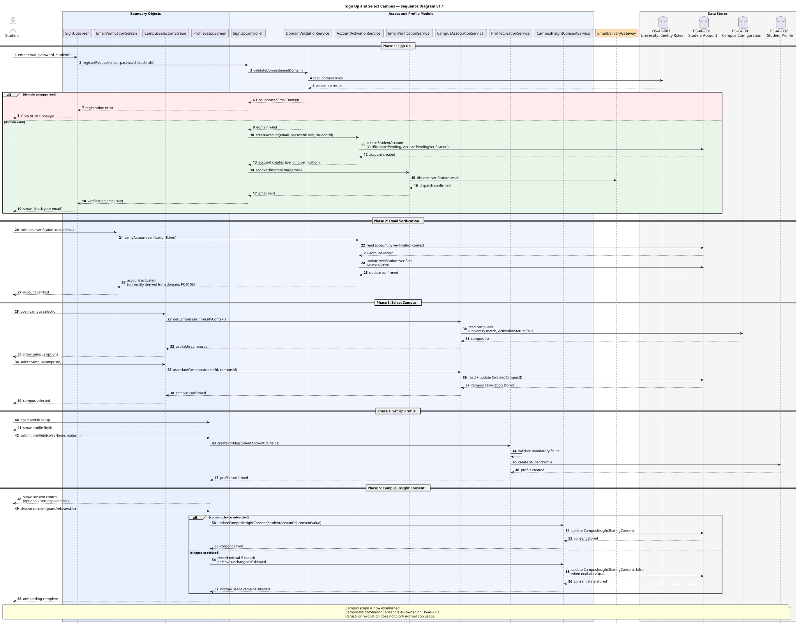
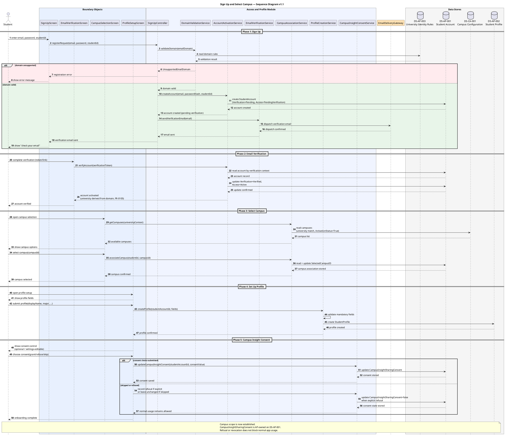

# Sign Up and Select Campus — Sequence Diagram v1.1

## Version Log

| Version | Date | Diagram | Change | Reason | Source |
|---|---|---|---|---|---|
| 1.1 | 2026-05-08 | Sign Up and Select Campus | Added DUC-AP-07 consent capture/update, stored `CampusInsightSharingConsent` on `DS-AP-001`, softened onboarding-blocking assumption, and rendered updated PlantUML. | Required before first code architecture skeleton. | Final documentation review + team decisions 2026-05-08 |

## Purpose

This sequence diagram shows the student onboarding flow from initial registration through campus selection, Student Profile creation, and optional campus insight consent capture/update. It combines DUC-AP-01, DUC-AP-03, DUC-AP-04, and the MVP consent behavior from DUC-AP-07 because the first skeleton needs a clear AP-owned realization for selected campus and consent state. Campus-scoped app usage depends on registration, verification, and campus association; consent refusal or later revocation does not block normal app usage.

## Related Use Case Realization

* DUC-AP-01 — Sign Up with University Email
* DUC-AP-03 — Select Campus
* DUC-AP-04 — Set Up Profile
* DUC-AP-07 — Update Campus Insight Consent

## Related Requirements

FR: FR-0101, FR-0102, FR-0103, FR-0104, FR-0105, FR-1601, FR-1401

NFR: NFR-01, NFR-02, NFR-03, NFR-04, NFR-05, NFR-30, NFR-27

## Participants

| Participant                         | Type       | Responsibility                                  |
| ----------------------------------- | ---------- | ----------------------------------------------- |
| Student                             | Actor      | External actor initiating onboarding            |
| SignUpScreen                        | Boundary   | Registration form UI                            |
| EmailVerificationScreen             | Boundary   | Verification completion UI                      |
| CampusSelectionScreen               | Boundary   | Campus selection UI                             |
| ProfileSetupScreen                  | Boundary   | Minimal profile creation UI                     |
| SignUpController                    | Control    | Coordinates sign-up request                     |
| DomainValidationService             | Service    | Validates email domain against university rules |
| AccountActivationService            | Service    | Creates account and handles activation          |
| EmailVerificationService            | Service    | Dispatches verification email                   |
| CampusAssociationService            | Service    | Retrieves campus list and associates campus     |
| ProfileCreationService              | Service    | Validates and creates the Student Profile       |
| CampusInsightConsentService         | Service    | Stores or updates campus insight sharing consent |
| EmailDeliveryGateway                | Gateway    | External email delivery mechanism               |
| DS-AP-003 University Identity Rules | Data Store | Supported email domains (read)                  |
| DS-AP-001 Student Account           | Data Store | Account record, SelectedCampusID, and CampusInsightSharingConsent (create, read, update) |
| DS-CA-001 Campus Configuration      | Data Store | Campus list (read, owned by CA)                 |
| DS-AP-002 Student Profile           | Data Store | Student Profile record with minimal public profile data (create) |

## Main Sequence Logic

1. Student enters university email, password, and university student ID on SignUpScreen.
2. SignUpScreen forwards registration request to SignUpController.
3. SignUpController calls DomainValidationService with the email domain.
4. DomainValidationService reads DS-AP-003 to check whether the domain matches a supported university identity rule.
5. DS-AP-003 returns the validation result.
6. \[alt] If domain is unsupported: DomainValidationService returns UnsupportedEmailDomain error to SignUpController, which returns error to SignUpScreen, which displays error to Student. Flow ends.
7. If domain is valid: SignUpController calls AccountActivationService.
8. AccountActivationService creates a new StudentAccount record in DS-AP-001 with VerificationStatus = Pending, PlatformAccessStatus = PendingVerification, and the hashed password.
9. DS-AP-001 confirms account created.
10. SignUpController calls EmailVerificationService.
11. EmailVerificationService dispatches a verification email through EmailDeliveryGateway.
12. EmailDeliveryGateway confirms dispatch.
13. SignUpController returns "verification email sent" to SignUpScreen, which shows confirmation to Student.
14. Student completes verification (clicks link or enters code) on EmailVerificationScreen.
15. EmailVerificationScreen sends verification token to AccountActivationService.
16. AccountActivationService reads DS-AP-001 to locate the account by verification context.
17. AccountActivationService updates DS-AP-001: VerificationStatus → Verified, PlatformAccessStatus → Active.
18. AccountActivationService derives university association from the verified email domain (FR-0105).
19. AccountActivationService returns activation success to EmailVerificationScreen, which confirms to Student.
20. System transitions to CampusSelectionScreen.
21. CampusSelectionScreen requests campus list from CampusAssociationService.
22. CampusAssociationService reads DS-CA-001 to retrieve campuses for the derived university where ActivationStatus = True.
23. DS-CA-001 returns campus list.
24. CampusAssociationService returns campus list to CampusSelectionScreen, which displays options to Student.
25. Student selects a campus and confirms.
26. CampusSelectionScreen sends selection to CampusAssociationService.
27. CampusAssociationService validates the selected campusId, then reads and updates DS-AP-001 to set SelectedCampusID.
28. DS-AP-001 confirms campus association stored.
29. CampusAssociationService returns confirmation to CampusSelectionScreen, which confirms to Student.
30. System transitions to ProfileSetupScreen.
31. ProfileSetupScreen displays required and optional profile fields to Student.
32. Student fills in profile fields and submits.
33. ProfileSetupScreen sends profile data to ProfileCreationService.
34. ProfileCreationService validates mandatory fields and format constraints.
35. ProfileCreationService creates a new StudentProfile record in DS-AP-002, linked to the authenticated StudentAccountID.
36. DS-AP-002 confirms profile created.
37. ProfileCreationService returns confirmation to ProfileSetupScreen, which confirms to Student.
38. ProfileSetupScreen offers the campus insight sharing consent control or links to the same control in account/profile settings.
39. Student grants, refuses, or skips consent.
40. CampusInsightConsentService updates DS-AP-001 with CampusInsightSharingConsent when the student makes or changes the choice.
41. Onboarding is complete. Campus scope is established. Student can access campus-scoped app features; consent refusal does not block normal usage.

## PlantUML Code

## Notes for Review

* This diagram combines three DUCs (AP-01, AP-03, AP-04) into one continuous onboarding sequence, as required by the workdoc ("Sign Up and Select Campus Sequence Diagram" must show all phases through to profile setup and campus scope establishment).
* DUC-AP-07 is included because consent-based Admin Insights are MVP for the first skeleton. Exact UI placement remains unresolved; onboarding and account/profile settings are both valid placement candidates.
* DS-CA-001 is owned by Campus Administration. AP reads it but does not create or modify campus records. This cross-subsystem read is consistent with the CRUD Matrix.
* The verification mechanism is modeled abstractly as a token exchange. The exact form (email link, code, SSO) is unresolved.
* Assumption for modeling only: Onboarding order is Sign Up → Select Campus → Set Up Profile → Consent prompt. Exact ordering is not fixed in requirements.
* The single-campus auto-confirm alternate scenario (A1 in Select Campus narrative) is not shown to keep the main flow clear.
* No events are emitted or consumed. No notification records are created. AP is pure user-initiated CRUD.

***
