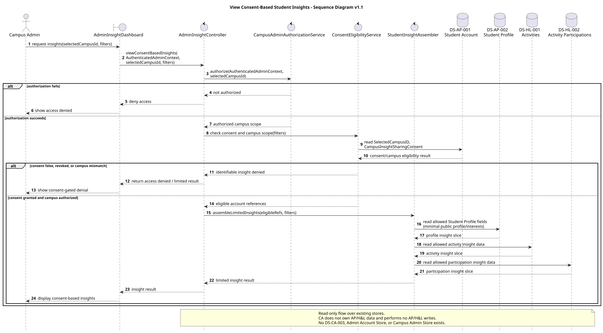
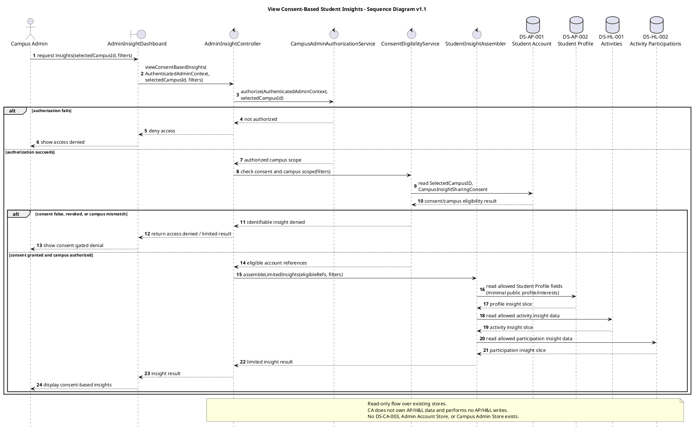

# View Consent-Based Student Insights — Sequence Diagram v1.1

## Version Log

| Version | Date | Diagram | Change | Reason | Source |
|---|---|---|---|---|---|
| 1.1 | 2026-05-08 | View Consent-Based Student Insights | Added MVP admin-only, campus-scoped, consent-gated, read-only insight sequence over existing AP/H&L stores. | Required before first code architecture skeleton. | Final documentation review + team decisions 2026-05-08 |

## Purpose

This sequence diagram realizes `DUC-CA-03 — View Consent-Based Student Insights` for the first code skeleton. It shows Campus Admin access through an admin-only portal, authorization via runtime `AuthenticatedAdminContext`, consent checks in `DS-AP-001 Student Account`, and read-only insight assembly from existing AP/H&L stores only when campus authorization and student consent both allow it.

## Related Use Case Realization

* DUC-CA-03 — View Consent-Based Student Insights
* DUC-AP-07 — Update Campus Insight Consent

## Related Requirements

FR: FR-2301, FR-2302, consent-based insight MVP requirements

NFR: NFR-06, NFR-07, NFR-08, NFR-09, NFR-37, NFR-38

## Participants

| Participant | Type | Responsibility |
|---|---|---|
| Campus Admin | Actor | Requests campus-scoped student insight data through an admin-only interface. |
| AdminInsightDashboard | Boundary | Admin-only portal view for insight request and result display. |
| AdminInsightController | Control | Coordinates authorization, consent checks, and read-only insight retrieval. |
| CampusAdminAuthorizationService | Service | Validates runtime `AuthenticatedAdminContext` and selected campus scope. |
| ConsentEligibilityService | Service | Checks `CampusInsightSharingConsent` and campus match in AP-owned account data. |
| StudentInsightAssembler | Service | Performs conditional read-only assembly of allowed insight data. |
| DS-AP-001 Student Account | Data Store | Stores selected campus and `CampusInsightSharingConsent` (read only in this flow). |
| DS-AP-002 Student Profile | Data Store | Provides consent-allowed minimal public profile/interests data (read only). |
| DS-HL-001 Activities | Data Store | Provides consent-allowed activity insight data (read only). |
| DS-HL-002 Activity Participations | Data Store | Provides consent-allowed participation insight data (read only). |

## Main Sequence Logic

1. Campus Admin opens the admin-only insight dashboard for a selected campus.
2. `AdminInsightController` receives the request with runtime `AuthenticatedAdminContext`.
3. `CampusAdminAuthorizationService` verifies the selected campus is included in `authorizedCampusIds`.
4. If admin authorization fails, the request is denied without reading student insight stores.
5. If authorization succeeds, `ConsentEligibilityService` reads `DS-AP-001` to check campus scope and `CampusInsightSharingConsent` for the requested student cohort or target.
6. If consent is false, revoked, or outside the authorized campus, identifiable insight access is denied.
7. If authorization and consent are valid, `StudentInsightAssembler` performs read-only access to allowed data from `DS-AP-002`, `DS-HL-001`, and `DS-HL-002`.
8. The dashboard displays a limited insight result. No AP/H&L/NSF/SM store is written.

## PlantUML Code

## Notes for Review

* `AuthenticatedAdminContext` is a runtime/admin-auth context object, not a database table.
* `CampusInsightSharingConsent` is stored in `DS-AP-001 Student Account` and owned by AP.
* If consent is false or revoked, normal student app usage continues but identifiable insight access is denied.
* Moderation/report-review access remains separate from Admin Insights.
* Exact aggregation metrics and UI presentation remain provisional for the first skeleton.
