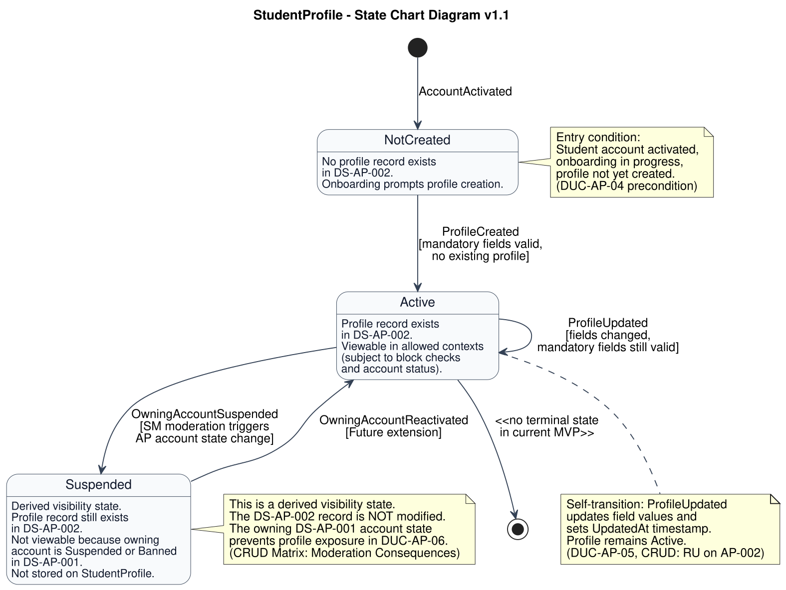

# Profile SCD v1.1

# Version Log

| Version | Date       | Diagram                       | Change                     | Reason                                                                             | Source                                                                                |
| ------- | ---------- | ----------------------------- | -------------------------- | ---------------------------------------------------------------------------------- | ------------------------------------------------------------------------------------- |
| 1.1   | 2026-05-08 | Profile Lifecycle State Chart | Final pre-skeleton alignment. | Renamed canonical profile references to Student Profile and clarified that Suspended is a derived/non-stored visibility condition based on DS-AP-001 account state. | Final documentation review + team decisions 2026-05-08 |
| 1.0     | 2026-05-08 | Profile Lifecycle State Chart | Initial state chart draft. | First lifecycle model derived from documented object states and use case behavior. | CRUD Matrix v1.5 + Entities & Attributes v1.1 + AP DFD WorkDoc v1.2 + DUC-AP-04/05/06 |



## Assigned Subsystems

* Access and Profile (AP)

## Diagrams Produced

| Diagram                       | Object Modeled | Related Use Cases                                          | Status | Notes                                                                                                                            |
| ----------------------------- | -------------- | ---------------------------------------------------------- | ------ | -------------------------------------------------------------------------------------------------------------------------------- |
| Profile Lifecycle State Chart | StudentProfile | Set Up Profile, Edit Profile, View Student Profile | Final pre-skeleton aligned | Profile has no explicit Status attribute. States are implicit, derived from record existence, content, and owning account state. |

## Source Documents Used

| Document                                               | How it was used                                                                                                                                                                                                                            |
| ------------------------------------------------------ | ------------------------------------------------------------------------------------------------------------------------------------------------------------------------------------------------------------------------------------------ |
| Use Case Realization (DUC-AP-04, DUC-AP-05, DUC-AP-06) | Confirmed profile creation, update, and viewing events, including block check and account validation preconditions.                                                                                                                        |
| Use Case Narrative (Set Up Profile, Edit Profile)      | Confirmed preconditions (no profile exists yet), postconditions (profile created and ready for display), and alternate flows (validation errors).                                                                                          |
| CRUD Matrix v1.5                                       | Confirmed Set Up Profile = C on AP-002, Edit Profile = RU on AP-002, View Student Profile = R on AP-002 + R on SM-001. Exposed data is minimal public profile data. No Delete on AP-002 documented. Moderation Consequences section confirmed account suspension/ban updates DS-AP-001. |
| Entities & Attributes v1.1                             | Confirmed StudentProfile has 10 attributes (ProfileID, StudentAccountID, DisplayName, Major, DateOfBirth, Gender, Interests, Languages, ShortBio, CreatedAt, UpdatedAt). No ProfileStatus attribute exists.                                |
| Databases / Data Stores (Databases.md)                 | Confirmed DS-AP-002 ownership by AP. Store description supports initial profile setup, later profile editing, and Student Profile viewing with minimal public profile data exposure.                                        |
| AP DFD WorkDoc v1.2                                    | Confirmed profile lifecycle as the third logical responsibility of the AP subsystem: "begins with the initial setup and continues with later editing." Profile viewing is a "controlled read" that does not change profile data.           |
| Sequence Diagram (Sign Up and Select Campus)           | Used only as support to confirm profile creation is the final onboarding phase (Phase 4).                                                                                                                                                  |

## State Decisions

| Object         | State      | Decision                                 | Reason                                                                                                                                                                                                                                                                                                                                                                                                                      |
| -------------- | ---------- | ---------------------------------------- | --------------------------------------------------------------------------------------------------------------------------------------------------------------------------------------------------------------------------------------------------------------------------------------------------------------------------------------------------------------------------------------------------------------------------- |
| StudentProfile | NotCreated | Included                                 | Implicit from Set Up Profile precondition: "The student has not yet created a profile." The profile record does not yet exist in DS-AP-002.                                                                                                                                                                                                                                                                                 |
| StudentProfile | Active     | Included                                 | Implicit from Set Up Profile postcondition: minimal public profile data has been created and associated with the student's account. The profile information is stored and ready to be displayed in relevant activity contexts.                                                                                                                                                                                                      |
| StudentProfile | Suspended  | Included \[Assumption for modeling only] | No explicit profile suspension state exists. However, when the owning account's PlatformAccessStatus is set to Suspended or Banned by SM moderation (CRUD Matrix: Moderation Consequences), DUC-AP-06 validates account status before profile exposure. A suspended/banned account means the profile is effectively not viewable. This is modeled as a derived visibility state, not an intrinsic profile attribute change. |
| StudentProfile | Deleted    | Excluded                                 | No Delete operation on DS-AP-002 is documented in the CRUD Matrix. Profile deletion is not modeled in the current MVP.                                                                                                                                                                                                                                                                                                      |

## Cross-Subsystem Notes

* Profile viewing (DUC-AP-06) reads DS-SM-001 (owned by SM) for block checks before exposing the profile. Block relationships affect per-request visibility but do not change the Profile object state. Therefore, block effects are not modeled as state transitions.
* SM moderation consequences (account suspension/ban) update DS-AP-001 (owned by AP). This account-level state change affects profile visibility because DUC-AP-06 validates account status before exposure. This is modeled as a cross-subsystem trigger to the Suspended state.
* NSF does not affect Profile state. No notification events create, update, or delete profile records.

## Open Points

* Unresolved: StudentProfile has no explicit Status attribute in the Entities & Attributes catalog. All states in this diagram are implicit, derived from record existence and owning account state. The team may decide to add an explicit ProfileStatus field in a future iteration.
* Unresolved: Whether account reactivation after suspension is supported in MVP is not documented. The Suspended → Active transition is marked as \[Future extension].
* Unresolved: Exact mandatory profile fields are not fixed. Validation guards reference "mandatory fields" abstractly.
* Assumption for modeling only: The Suspended state is a derived visibility state, not a physical attribute change on the DS-AP-002 record. It represents the condition where the profile record exists but is not viewable because the owning account is not Active.

***

# StudentProfile — State Chart Diagram v1.1

## Purpose

This state chart models the lifecycle of the StudentProfile object (`DS-AP-002 Student Profile`) within the Access and Profile subsystem. The StudentProfile is the public-facing profile record whose exposed fields remain limited to minimal public profile data in allowed activity contexts (join request review, activity details). Its lifecycle begins when the profile is created during post-registration onboarding, continues through optional edits, and may become effectively invisible if the owning student account is suspended or banned by moderation. The StudentProfile entity does not have an explicit Status attribute; all states in this diagram are implicit, derived from record existence in DS-AP-002 and the owning account's PlatformAccessStatus in DS-AP-001.

## State Owner

* Access and Profile (AP)

## Related Use Cases

* Set Up Profile (DUC-AP-04)
* Edit Profile (DUC-AP-05)
* View Student Profile (DUC-AP-06)
* Review Report (SM, cross-subsystem trigger for account suspension/ban)

## Related Requirements

FR: FR-1401, FR-1402, FR-1403, FR-0501

NFR: NFR-27, NFR-28, NFR-36

## Source Documents Used

* Use Case Realization cards: DUC-AP-04, DUC-AP-05, DUC-AP-06
* Use case narratives: Set Up Profile, Edit Profile, View Student Profile
* CRUD Matrix v1.5
* AP DFD WorkDoc v1.2
* Entities & Attributes catalog v1.1
* Databases / Data Stores document (Databases.md)
* Sequence Diagram: Sign Up and Select Campus (support only)

## Object Being Modeled

| Object         | Store / Entity             | Owner                   | Reason for State Chart                                                                                                                                                                                                                                                                                                |
| -------------- | -------------------------- | ----------------------- | --------------------------------------------------------------------------------------------------------------------------------------------------------------------------------------------------------------------------------------------------------------------------------------------------------------------- |
| StudentProfile | DS-AP-002 Student Profile / StudentProfile | Access and Profile (AP) | The profile has a meaningful lifecycle: it does not exist before onboarding, is created during Set Up Profile, is maintained through Edit Profile, is exposed under strict visibility rules in View Student Profile, and may become effectively invisible when the owning account is suspended by moderation. |

## States

| State      | Meaning                                                                                                                                                                                                                                    | Source / Justification                                                                                                                                                                                                                                                    |
| ---------- | ------------------------------------------------------------------------------------------------------------------------------------------------------------------------------------------------------------------------------------------ | ------------------------------------------------------------------------------------------------------------------------------------------------------------------------------------------------------------------------------------------------------------------------- |
| NotCreated | The student has a verified, activated account but has not yet completed profile setup. No record exists in DS-AP-002 for this StudentAccountID.                                                                                            | Set Up Profile precondition: "The student has not yet created a profile (this is the initial profile creation, not an edit)." DUC-AP-04 precondition: profile does not exist.                                                                                             |
| Active     | The profile record exists in DS-AP-002. It is available for viewing in allowed activity contexts, subject to block checks and owning account being Active.                                                                                 | Set Up Profile postcondition: minimal public profile data has been created and stored for display in relevant activity contexts. DUC-AP-04 postcondition: DS-AP-002 contains a new StudentProfile record.                             |
| Suspended  | The profile record still exists in DS-AP-002, but the owning account's PlatformAccessStatus is Suspended or Banned. Profile viewing is blocked because DUC-AP-06 validates account status before exposure. \[Assumption for modeling only] | CRUD Matrix v1.5 System Invariant (Moderation Consequences): "Moderation outcomes applied to users (suspensions/bans) update the DS-AP-001 (UserAccountStore) state." DUC-AP-06 Main Design Flow step 7-9: account status and block checks occur before profile exposure. |

## Transition Table

| From State | To State   | Trigger / Event          | Guard / Condition                                                                                                              | Effect                                                                                                                                                                                           |
| ---------- | ---------- | ------------------------ | ------------------------------------------------------------------------------------------------------------------------------ | ------------------------------------------------------------------------------------------------------------------------------------------------------------------------------------------------ |
| \[Initial] | NotCreated | AccountActivated         | Student account is verified and activated (PlatformAccessStatus = Active). Onboarding has started.                             | Student has a valid account but no profile record in DS-AP-002. The system prompts profile creation as part of onboarding.                                                                       |
| NotCreated | Active     | ProfileCreated           | All mandatory profile fields are valid and submitted. No profile record already exists for this StudentAccountID in DS-AP-002. | A new StudentProfile record is created in DS-AP-002 with CreatedAt timestamp. Profile is now available for viewing in allowed activity contexts. (DUC-AP-04, CRUD: C on AP-002)                  |
| Active     | Active     | ProfileUpdated           | At least one editable field is changed. Mandatory fields remain populated after update.                                        | StudentProfile record in DS-AP-002 is updated. UpdatedAt timestamp is set. New field values are available for all future viewing contexts. (DUC-AP-05, CRUD: RU on AP-002)                       |
| Active     | Suspended  | OwningAccountSuspended   | SM moderation triggers AP account state change: PlatformAccessStatus is set to Suspended or Banned on DS-AP-001.               | Profile record in DS-AP-002 is unchanged. Profile viewing is blocked because DUC-AP-06 validates account status before exposure. \[Assumption for modeling only — cross-subsystem trigger]       |
| Suspended  | Active     | OwningAccountReactivated | AP restores PlatformAccessStatus to Active on DS-AP-001. \[Future extension]                                                   | Profile record in DS-AP-002 is unchanged. Profile viewing becomes available again because account status check passes. \[Future extension — reactivation behavior not documented in current MVP] |

## PlantUML Code

```
@startuml
title StudentProfile - State Chart Diagram v1.1

skinparam shadowing false
skinparam dpi 180
skinparam defaultFontName Helvetica
skinparam backgroundColor #FFFFFF
skinparam state {
  BackgroundColor #F8FAFC
  BorderColor #334155
  FontColor #0F172A
  ArrowColor #334155
}

[*] --> NotCreated : AccountActivated

state NotCreated : No profile record exists\nin DS-AP-002.\nOnboarding prompts profile creation.

state Active : Profile record exists\nin DS-AP-002.\nViewable in allowed contexts\n(subject to block checks\nand account status).

state Suspended : Derived visibility state.\nProfile record still exists\nin DS-AP-002.\nNot viewable because owning\naccount is Suspended or Banned\nin DS-AP-001.\nNot stored on StudentProfile.

NotCreated --> Active : ProfileCreated\n[mandatory fields valid,\nno existing profile]

Active --> Active : ProfileUpdated\n[fields changed,\nmandatory fields still valid]

Active --> Suspended : OwningAccountSuspended\n[SM moderation triggers\nAP account state change]

Suspended --> Active : OwningAccountReactivated\n[Future extension]

Active --> [*] : <<no terminal state\nin current MVP>>

note right of NotCreated
  Entry condition:
  Student account activated,
  onboarding in progress,
  profile not yet created.
  (DUC-AP-04 precondition)
end note

note right of Suspended
  This is a derived visibility state.
  The DS-AP-002 record is NOT modified.
  The owning DS-AP-001 account state
  prevents profile exposure in DUC-AP-06.
  (CRUD Matrix: Moderation Consequences)
end note

note bottom of Active
  Self-transition: ProfileUpdated
  updates field values and
  sets UpdatedAt timestamp.
  Profile remains Active.
  (DUC-AP-05, CRUD: RU on AP-002)
end note

@enduml
```

## Notes for Review

* **Review Rule 1 (one object, not a process):** This diagram models the lifecycle of the StudentProfile object, not the onboarding process or profile viewing workflow.
* **Review Rule 2 (documented states):** NotCreated and Active are derived from documented preconditions/postconditions in Set Up Profile. Suspended is explicitly marked as \[Assumption for modeling only] because it is a derived visibility state, not an intrinsic attribute.
* **Review Rule 3 (triggering events):** Every transition has a named event. ProfileCreated (DUC-AP-04), ProfileUpdated (DUC-AP-05), OwningAccountSuspended (CRUD Matrix Moderation Consequences), OwningAccountReactivated (\[Future extension]).
* **Review Rule 4 (guards):** Guards are used on ProfileCreated (mandatory fields valid), ProfileUpdated (fields changed), and OwningAccountSuspended (SM moderation trigger).
* **Review Rule 5 (correct owner):** AP owns StudentProfile (DS-AP-002). Confirmed in CRUD Matrix and Databases.md.
* **Review Rule 6 (no new entities):** No new actors, entities, data stores, or requirements are introduced.
* **Review Rule 7 (not a sequence/activity diagram):** The diagram shows object states and transitions, not the step-by-step process of creating or editing a profile.
* **Review Rule 8 (CRUD support):** Set Up Profile = C on AP-002, Edit Profile = RU on AP-002. No D on AP-002 documented. All confirmed in CRUD Matrix v1.5.
* **Review Rule 9 (names match):** Entity name "StudentProfile", store "DS-AP-002 Student Profile" match the final canonical profile naming decision.
* **Review Rule 10 (cross-subsystem as triggers):** Account suspension is modeled as an external trigger from SM moderation, not as a direct SM write to DS-AP-002. AP retains ownership.
* **Review Rule 11 (PostMVP excluded):** OwningAccountReactivated is explicitly marked as \[Future extension]. No other PostMVP behavior is included.
* **Review Rule 12 (open points documented):** Four open points are documented in the WorkDoc section. No state or transition is silently resolved.
* **Key modeling decision:** The StudentProfile entity has no explicit Status attribute. The "Suspended" state is a derived visibility state based on the owning account's PlatformAccessStatus, not a physical change to DS-AP-002. This decision is transparent and documented.
* **Block relationships** affect per-request profile visibility but do NOT change Profile object state. They are enforced at read-time by DUC-AP-06 and are intentionally not modeled as state transitions. This is consistent with SM ownership of block truth and AP ownership of profile truth.
