# Use Case Diagram v1.7

# InCampus Use Case Diagram - PlantUML v1.7

## Version Log

| Version | Date       | Section modified                     | Description of change                                                                                                                                                                                                                                  | Reason for change                                                                                                       | Source document |
| ------- | ---------- | ------------------------------------ | ------------------------------------------------------------------------------------------------------------------------------------------------------------------------------------------------------------------------------------------------------ | ----------------------------------------------------------------------------------------------------------------------- | --------------- |
| 1.7     | 2026-05-08 | Final pre-skeleton alignment         | Rebuilt the normative MVP diagram source to include `DUC-AP-07 -- Update Campus Insight Consent`, `DUC-CA-03 -- View Consent-Based Student Insights`, Activity Reminder as MVP, canonical Student Profile naming, and no deferred/postMVP package. | Required before using the use case diagram as input for the first code architecture skeleton.                            | Final documentation review + team decisions 2026-05-08 |
| 1.6     | 2026-05-06 | Deferred postMVP package             | Removed the `Deferred postMVP` package and all use cases marked as deferred or postMVP.                                                                                                                                                                | The diagram must show only current non-deferred use cases and avoid clutter from out-of-scope future functionality.      | Current PlantUML diagram; Use cases v1.1 |
| 1.5     | 2026-05-06 | Access and profile; Campus admin     | Added consent-based student insight sharing and the corresponding campus-admin insight access use case.                                                                                                                                                | The updated use case table introduces a new student-side consent capability and a corresponding campus-admin access use. | Use cases v1.1 |

## Normative PlantUML Source

```plantuml
@startuml InCampusUseCaseDiagramV17
title InCampus Use Case Diagram v1.7 - MVP First Skeleton

left to right direction

skinparam shadowing false
skinparam packageStyle rectangle
skinparam linetype ortho
skinparam dpi 200
skinparam defaultFontName Helvetica
skinparam wrapWidth 180

skinparam actor {
  BorderColor #334155
  BackgroundColor #F8FAFC
  FontColor #0F172A
}

skinparam package {
  BorderColor #475569
  BackgroundColor #FFFFFF
  FontColor #0F172A
}

skinparam usecase {
  BorderColor #334155
  BackgroundColor #FFFFFF
  FontColor #111827
}

actor Student
actor "Student\nHost" as Host
actor "Student\nGuest" as Guest
actor "Campus\nAdmin" as Admin

Host --|> Student
Guest --|> Student

rectangle "InCampus system" {
  package "Access and Profile" {
    usecase "[US-01]\nSign Up with\nUniversity Email" as UC_SignUp
    usecase "[US-15]\nSign In" as UC_SignIn
    usecase "[US-16]\nSelect Campus" as UC_SelectCampus
    usecase "[US-14]\nSet Up\nStudent Profile" as UC_SetUpProfile
    usecase "[US-14]\nEdit\nStudent Profile" as UC_EditProfile
    usecase "[US-22]\nView\nStudent Profile" as UC_ViewProfile
    usecase "[DUC-AP-07]\nUpdate Campus\nInsight Consent" as UC_UpdateConsent
  }

  package "Discovery and Participation" {
    usecase "[US-04]\nBrowse and Filter\nActivities" as UC_Browse
    usecase "[US-21]\nView Activity\nDetails" as UC_ViewDetails
    usecase "[US-20]\nJoin Activity" as UC_Join
    usecase "[US-27]\nWithdraw Join\nRequest" as UC_Withdraw
    usecase "[US-27]\nLeave Joined\nActivity" as UC_Leave
    usecase "[US-09]\nView Personal\nActivity List" as UC_PersonalList
  }

  package "Hosting and Lifecycle" {
    usecase "[US-03]\nCreate Activity" as UC_CreateActivity
    usecase "[US-05]\nManage Join\nRequests" as UC_ManageRequests
    usecase "[US-05 / US-28]\nUpdate Activity\nStatus" as UC_UpdateStatus
    usecase "[US-26]\nDelete Activity" as UC_DeleteActivity
  }

  package "Notifications and System Flow" {
    usecase "[US-06]\nNotify Host of\nJoin Event" as UC_NotifyHost
    usecase "[US-07]\nNotify Participant of\nApplication Outcome" as UC_NotifyOutcome
    usecase "[US-28]\nNotify Participant of\nActivity Cancellation" as UC_NotifyCancellation
    usecase "[US-11]\nReceive Activity\nReminder" as UC_ActivityReminder
  }

  package "Safety and Moderation" {
    usecase "[US-19]\nView Community\nRules" as UC_ViewRules
    usecase "[US-17]\nReport User\nor Activity" as UC_Report
    usecase "[US-18]\nBlock User" as UC_Block
    usecase "[US-02]\nReview Report" as UC_ReviewReport
  }

  package "Campus Administration" {
    usecase "[US-23]\nConfigure New\nCampus" as UC_ConfigureCampus
    usecase "[US-24]\nManage Campus\nStructured Options" as UC_ManageOptions
    usecase "[DUC-CA-03]\nView Consent-Based\nStudent Insights" as UC_AdminInsights
  }
}

Student --> UC_SignUp
Student --> UC_SignIn
Student --> UC_SelectCampus
Student --> UC_SetUpProfile
Student --> UC_EditProfile
Student --> UC_ViewProfile
Student --> UC_UpdateConsent

Guest --> UC_Browse
Guest --> UC_ViewDetails
Guest --> UC_Join
Guest --> UC_Withdraw
Guest --> UC_Leave
Guest --> UC_PersonalList

Host --> UC_CreateActivity
Host --> UC_ManageRequests
Host --> UC_UpdateStatus
Host --> UC_DeleteActivity

Student --> UC_ViewRules
Student --> UC_Report
Student --> UC_Block

Admin --> UC_ConfigureCampus
Admin --> UC_ManageOptions
Admin --> UC_ReviewReport
Admin --> UC_AdminInsights

UC_Join ..> UC_ViewDetails : <<include>>
UC_ManageRequests ..> UC_ViewProfile : <<include>>
UC_Report ..> UC_ViewRules : <<include>>
UC_AdminInsights ..> UC_UpdateConsent : consent checked

note right of UC_Withdraw
Pending request withdrawal creates no
host notification and no DS-NS-001 record.
end note

note right of UC_AdminInsights
Uses AuthenticatedAdminContext.
Campus-scoped, consent-gated, read-only
access over existing AP/H&L stores.
No new admin store.
end note

note right of UC_ActivityReminder
Activity Reminder is MVP.
Opening notifications remains read-only.
end note

@enduml
```

## Rendered Diagram

## Alignment Notes

* This v1.7 diagram is the normative use-case diagram for the first skeleton. Older v1.1-v1.6 diagram snapshots are superseded by this source.
* `Set Activity Date and Time` is not represented as a standalone use case; date/time remains part of `Create Activity`.
* `DUC-AP-07` and `DUC-CA-03` are MVP use cases and use existing stores only.
