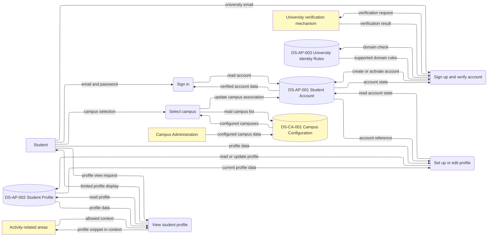
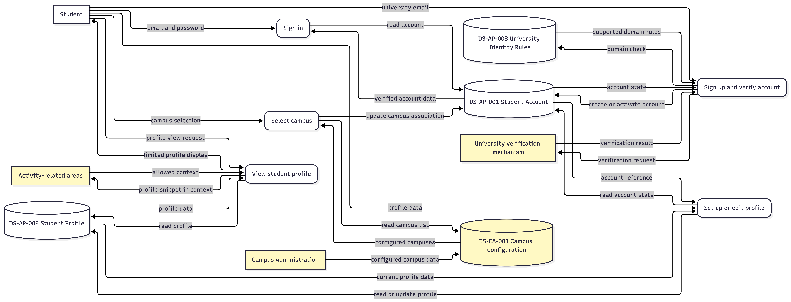

# AP - DFD

```mermaid
---
config:
  layout: elk
---
flowchart LR
    Student["Student"] -- university email --> P1("Sign up and verify account")
    P1 -- verification request --> Verify["University verification mechanism"]
    Verify -- verification result --> P1
    P1 -- domain check --> D4["DS-AP-003 University Identity Rules"]
    D4 -- supported domain rules --> P1
    P1 -- create or activate account --> D2["DS-AP-001 Student Account"]
    D2 -- account state --> P1
    Student -- email and password --> P2("Sign in")
    P2 -- read account --> D2
    D2 -- verified account data --> P2
    Student -- campus selection --> P3("Select campus")
    P3 -- read campus list --> D1["DS-CA-001 Campus Configuration"]
    D1 -- configured campuses --> P3
    CampusAdmin["Campus Administration"] -- configured campus data --> D1
    P3 -- update campus association --> D2
    Student -- profile data --> P4("Set up or edit profile")
    P4 -- read account state --> D2
    D2 -- account reference --> P4
    P4 -- read or update profile --> D3["DS-AP-002 Student Profile"]
    D3 -- current profile data --> P4
    Student -- profile view request --> P5("View student profile")
    ActivityArea["Activity-related areas"] -- allowed context --> P5
    P5 -- read profile --> D3
    D3 -- profile data --> P5
    P5 -- limited profile display --> Student
    P5 -- profile snippet in context --> ActivityArea

    D4@{ shape: cyl}
    D2@{ shape: cyl}
    D1@{ shape: cyl}
    D3@{ shape: cyl}
    style Verify fill:#FFF9C4
    style D1 fill:#FFF9C4
    style CampusAdmin fill:#FFF9C4
    style ActivityArea fill:#FFF9C4
```

