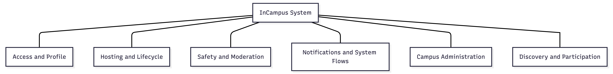
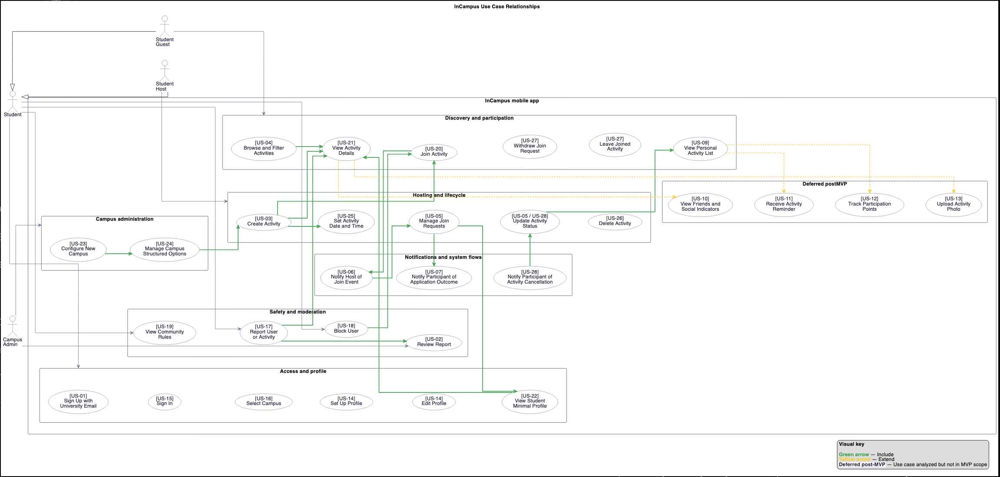

# Architecture workdoc

# Software Architecture. The complete workflow

We do not transform the use-case diagram directly into the final DFD. Each person should start from one or more of the existing functional subgroups in the current use-case diagram and use them as a starting point to reason about the system’s logical functions, business events, and data movements. The subgroup is a decomposition aid, not automatically a final DFD process. 

THE TASK OUTPUT: data flow for each uses cases (if completely separated) of the subsection you have been assigned to. Procedure:

1. Read the use cases in the assigned subgroup together with their narratives (each use case has its document with the full narrative).

The first step is to carefully read the use cases that belong to the assigned subgroup and, above all, their corresponding narratives. The purpose is not to start drawing the final DFD immediately, but to understand what is actually happening in that part of the system. By reading the narratives, you should understand who triggers the behavior, what the actor is trying to achieve, how the system responds, which inputs and outputs are involved, and which exceptions or constraints appear in the interaction. In other words, this step is meant to build a clear understanding of the logic of that area before any modeling begins.

1. Build a list of the main events in the subgroup (in most of the case all the info are already in the NARRATIVES in individual page of the use case)

Once the narratives are understood, the next step is to extract the main business events or triggers that characterize that subgroup. For each event, you should identify what triggers it, who initiates it, what response is expected from the system, which information enters the system, which information leaves it, and which information needs to be read or stored. The goal is to move from a narrative description of interaction to a more structured understanding of system behavior, which will later make it much easier to identify logical processes, data flows, and candidate data stores.

1. Identify the candidate data stores needed by your subsection.

After understanding the events and flows in your assigned subsection, think about which logical data stores that part of the system needs in order to work. Start from the flow itself: ask what data must be read, created, updated, or deleted. Then compare your candidate stores with the shared database/store list below. If a store you need is already there, reuse it. If a very similar store already exists but its definition is incomplete or slightly wrong for your subsection, propose a modification instead of creating a duplicate. If the required store is not present at all, add a new candidate store with a proper ID and a short explanation of why it is needed.

1. Prepare a first sketch of the data flow for your subsection.

At this stage, do not try to draw the final DFD yet. First, prepare a rough but structured sketch of how data moves inside your subsection. Use a simple textual format such as arrows, short lists, or step-by-step flow notes. The goal is to make the logic visible before turning it into a diagram. For each important event, show who or what triggers the flow, which logical process receives the input, which data store is read or updated, and what output or response is produced. This sketch should help clarify the sequence of interactions, the main data movements, and the connections with adjacent subsections. It is only a working draft, so clarity matters more than notation accuracy.

At the end, we review everything again for consistency: scope, process names, flow names, store names, unsupported assumptions, and traceability back to the approved project material. The final result of this week is not just “a DFD”, but one coherent logical modeling package, including [DFD integration and Merge](https://app.affine.pro/workspace/d111b336-4261-4720-a05c-80fffe2c0b23/oLFYD4ocigUCOKKX_6ka9) and [CRUD matrix](https://app.affine.pro/workspace/d111b336-4261-4720-a05c-80fffe2c0b23/SIMeqI1ovH)

[Databases](https://app.affine.pro/workspace/d111b336-4261-4720-a05c-80fffe2c0b23/6ozREISfbjUmJiFHOHxf3)

