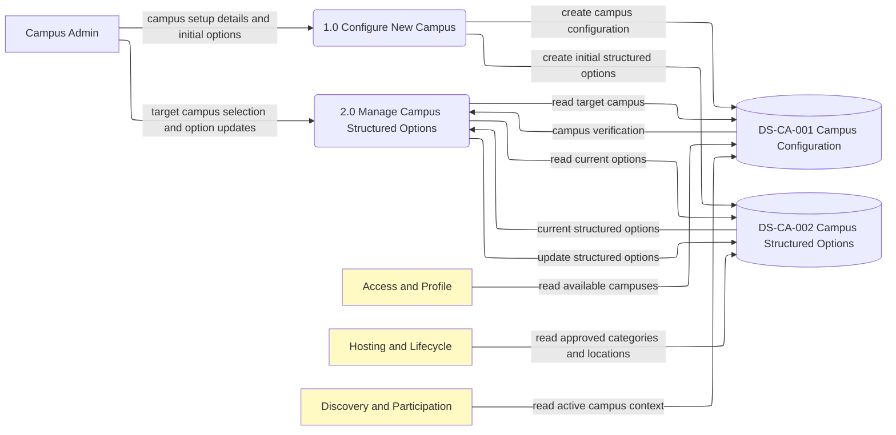
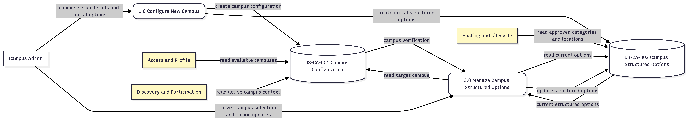
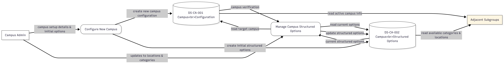

# CA - DFD

# V2.0

review: perfect logic, i inserted the specific subgroup it's related to instead of adjacent subgroups; campus admin before the configure should select the target campus from a list of campuses he's auth to modify, isn't it?

# V1.0

```mermaid
flowchart LR
    %% Styles
    classDef entity fill:#ffffff,stroke:#333333,stroke-width:1px
    classDef entityYellow fill:#fdf6e3,stroke:#333333,stroke-width:1px
    classDef process fill:#ffffff,stroke:#333333,stroke-width:1px,rx:15,ry:15
    classDef datastore fill:#ffffff,stroke:#333333,stroke-width:1px
    classDef datastoreYellow fill:#fdf6e3,stroke:#333333,stroke-width:1px

    %% External Entities and Adjacent Subgroups (Yellow)
    AdjSubgroups[Adjacent Subgroups]:::entityYellow

    %% Internal Entities
    CampusAdmin[Campus Admin]:::entity

    %% Logical Processes
    ConfigCampus([Configure New Campus]):::process
    ManageOpts([Manage Campus Structured Options]):::process

    %% Data Stores (Internal)
    DS_CA001[(DS-CA-001 Campus&lt;br&gt;Configuration)]:::datastore
    DS_CA002[(DS-CA-002 Campus&lt;br&gt;Structured Options)]:::datastore

    %% --- Data Flows ---

    %% Configure New Campus
    CampusAdmin -->|campus setup details & initial options| ConfigCampus
    ConfigCampus -->|create new campus configuration| DS_CA001
    ConfigCampus -->|create initial structured options| DS_CA002

    %% Manage Campus Structured Options
    CampusAdmin -->|updates to locations & categories| ManageOpts
    ManageOpts -->|read target campus| DS_CA001
    DS_CA001 -->|campus verification| ManageOpts
    ManageOpts -->|read current options| DS_CA002
    DS_CA002 -->|current structured options| ManageOpts
    ManageOpts -->|update structured options| DS_CA002

    %% Data Read by Adjacent Subgroups
    DS_CA001 -->|read active campus info| AdjSubgroups
    DS_CA002 -->|read available categories & locations| AdjSubgroups
```

