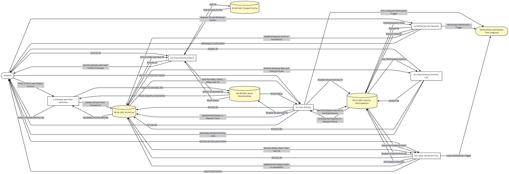
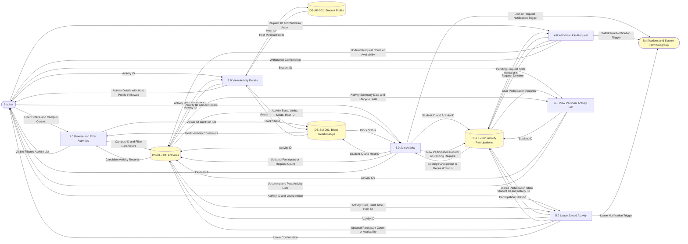
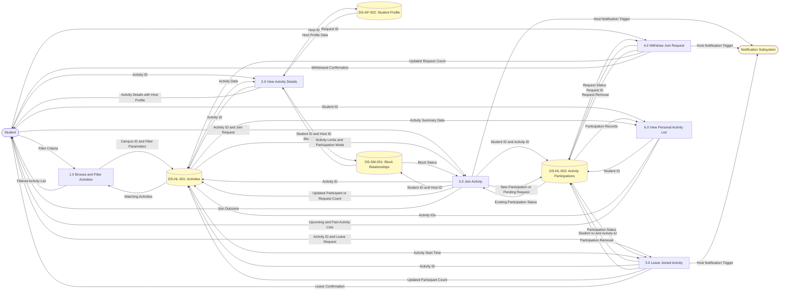
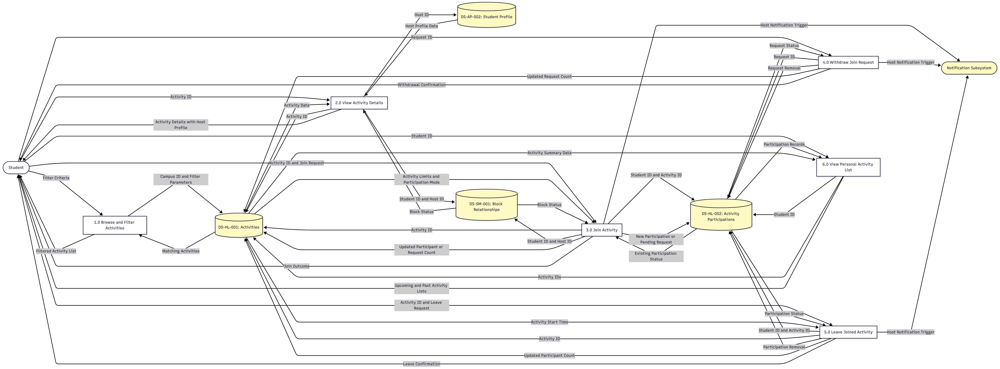
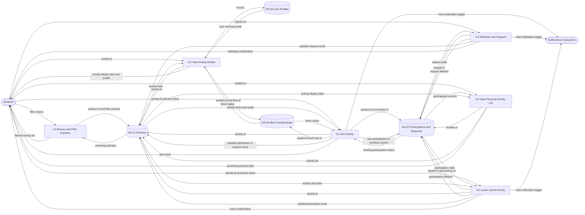
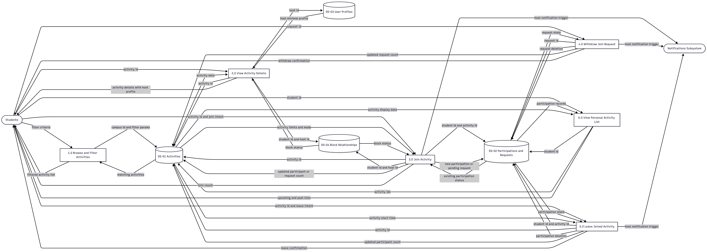

# D\&P - DFD

# V3.0

# V2.0

review: databases names did not match and there was a mismatch with database **DS-TBD: Block Relationships**. colored the sections not strictly regarding this subsection

# V1.0

