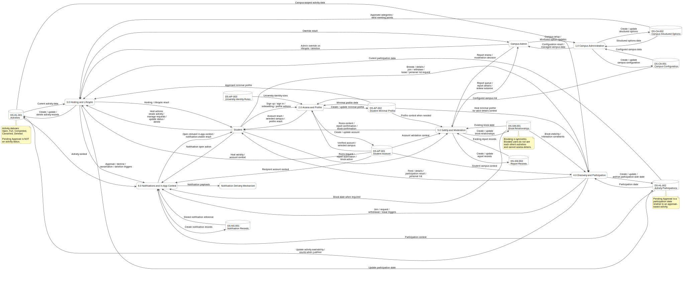
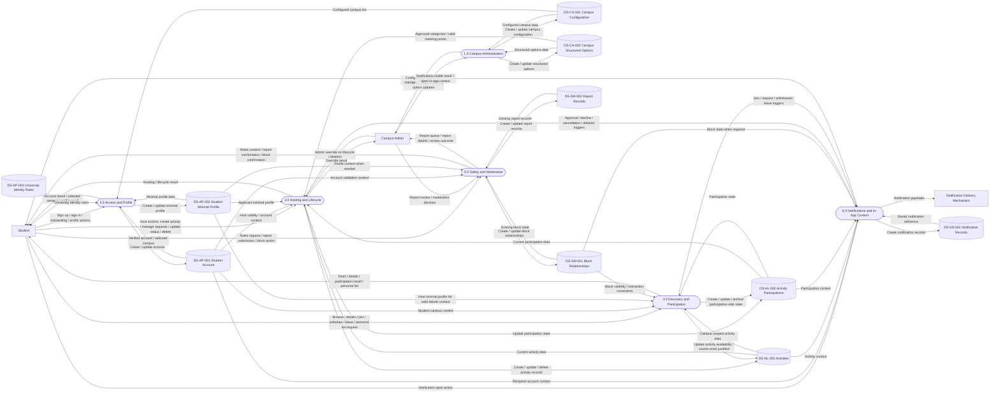

# DFD integration and Merge

# PlantUML

# Mermaid

# Locked interpretation behind this DFD

`Pending Approval` is **not** an activity status. It belongs in `DS-HL-002 Activity Participations` as a guest participation state for approval-based activities. The activity itself remains `Open` until it becomes `Full`, `Completed`, `Cancelled`, or `Deleted`. 

Block behavior is now modeled as **symmetric visibility and interaction filtering**. That means `DS-SM-001 Block Relationships` affects Discovery not only at join/request time, but already at feed/details visibility stage. This is why `P4` reads `D8` as a hard filtering input, not as a minor optional check. That resolves the earlier ambiguity about whether block affects only interaction or also visibility. 

`DS-HL-001 Activities` and `DS-HL-002 Activity Participations` remain owned by Hosting and Lifecycle, but Discovery and Participation is allowed to perform justified updates for join, withdraw, and leave. That ownership-versus-write-access distinction is intentional and must be preserved again in the CRUD Matrix. 

Notifications are fed by both H\&L and D\&P. The stable notification families are:

* &#x20;host notification after join/join request, 
* &#x20;participant notification after approval/decline, 
* &#x20;participant notification after cancellation, 
* &#x20;host notification after withdrawal/leave. 

Deletion remains different from cancellation and completion: when an activity is deleted, it is removed from active discovery views, which is consistent with the functional requirements for deletion and with your final merge rule that deleted activities should no longer be visible or reopenable as normal activity targets. 

# InCampus - Skeleton for the Unified DFD Merge

The final integrated DFD should be built around a small number of stable logical areas rather than around isolated subgroup diagrams. The evidence across the subgroup materials supports a six-process Level-1 structure in which each area keeps its own responsibility, ownership, and interfaces clear. Campus Administration remains an upstream structural provider; Access and Profile manages identity and profile state; Hosting and Lifecycle owns activity and participation truth; Discovery and Participation handles student-side interaction with existing activities; Safety and Moderation governs block and report logic; Notifications and System Flow reacts to upstream business events and persists notification consequences. This separation is consistent with the merge guidance in the subgroup workdocs and with the current cross-subgroup store usage.

## 1. Final Level-1 process structure

The integrated Level-1 DFD should use the following six internal processes.

### 1.0 Campus Administration

This process group covers campus initialization and maintenance of campus structured options. It is driven directly by the Campus Admin and should remain isolated from student-facing social logic. The subgroup owns `DS-CA-001 Campus Configuration` and `DS-CA-002 Campus Structured Options`, and exports their contents downstream as read-only context.

### 2.0 Access and Profile

This process group covers sign-up with university email, sign-in, campus selection, profile setup and editing, and minimal profile access in allowed contexts. It is the stable source of account and profile truth for the rest of the application.

### 3.0 Hosting and Lifecycle

This process group owns the operational core of the app: activity creation, host-side participation management, lifecycle changes, and deletion. It owns activity truth and participation truth and sits at the center of activity validation, request handling, lifecycle control, and downstream consequences.

### 4.0 Discovery and Participation

This process group covers browse and filter, activity details, join, withdraw, leave, and personal activity list. It is the student-facing interaction layer for already existing activities. It reads heavily from the stores owned by Hosting and Lifecycle and generates host-side notification triggers for join/request, withdraw, and leave.

### 5.0 Safety and Moderation

This process group covers community rules access, report submission, report review, and block enforcement. It owns the moderation-specific truth and exposes enforcement behavior to other areas through block checks.

### 6.0 Notifications and System Flow

This process group detects notification-relevant events, resolves recipients and context, stores notification records, delivers the notification, and reopens the appropriate in-app context when the user taps it. It must remain reactive: it does not create activity, participation, or account truth, but consumes upstream truth and produces notification consequences.

## 2. External entities for the unified DFD

The minimum confirmed external entities are:

* **Student**
* **Campus Admin**
* **Notification Subsystem / Delivery Mechanism**

The notification boundary should remain explicit in the final DFD because notifications are an important confirmed subgroup and not just an implementation detail.

## 3. Final store set for the integrated model

The unified DFD should include the following final stores, with no renaming:

* `DS-CA-001 Campus Configuration`
* `DS-CA-002 Campus Structured Options`
* `DS-AP-001 Student Account`
* `DS-AP-002 Student Minimal Profile`
* `DS-AP-003 University Identity Rules`
* `DS-HL-001 Activities`
* `DS-HL-002 Activity Participations`
* `DS-SM-001 Block Relationships`
* `DS-SM-002 Report Records`
* `DS-NS-001 Notification Records`

## 4. Final cross-subgroup flows that must be preserved

Campus Administration exports structural truth downstream. `DS-CA-001` feeds Access and Profile for campus selection logic, and campus-scoped discovery depends on the active campus identity. `DS-CA-002` is read by Hosting and Lifecycle to validate approved categories and meeting points during activity creation.

Access and Profile exports identity and profile truth. Hosting and Lifecycle reads `DS-AP-001` for host validity and `DS-AP-002` to display applicant profile data during join-request management. Safety and Moderation reads account and profile data for identification and enforcement. Notifications reads `DS-AP-001` to resolve recipients as valid users.

Hosting and Lifecycle owns activity and participation truth, while Discovery and Participation consumes and partially updates it. `DS-HL-001 Activities` and `DS-HL-002 Activity Participations` remain the central stores for activity birth, maintenance, lifecycle, and participation state. Discovery and Participation reads these stores for feed, details, personal list, join, withdraw, and leave. At the same time, D\&P performs justified updates to those stores through join, withdrawal, and leave flows. Ownership remains in H\&L, but write access exists in specific D\&P processes.

Notifications must be fed by both H\&L and D\&P. From H\&L, Notifications receives approval, decline, cancellation, and deletion triggers. From D\&P, Notifications receives host-side triggers for join/request, withdraw, and leave.

Safety and Moderation remains an enforcement source, not a duplicated interaction layer. D\&P must query block logic for both visibility filtering and interaction prevention. Reciprocal blocked activities must not appear in Discovery and therefore cannot open details or interaction paths.

## 5. Final interpretation of activity and participation state

The final **activity statuses** are:

* `Open`
* `Full`
* `Completed`
* `Cancelled`
* `Deleted`

`Pending Approval` is **not** an activity status. It is a **guest participation status** relative to an approval-based activity and belongs in `DS-HL-002 Activity Participations`, not in `DS-HL-001 Activities`.

An approval-based activity that is still available remains `Open` in Discovery. Regular users must not see that pending requests already exist. That information is visible only to the host through request-management flows.

`Completed` is a real stored activity status and must remain visible in history/profile contexts. `Deleted` removes the activity record from the active activity store.

`Full`, `Cancelled`, and `Deleted` are not shown in Discovery. `Completed` is not part of Discovery either, but it remains relevant in history/profile contexts.

## 6. Final interpretation of block behavior

Block behavior is **symmetric** for activity interaction. If user A blocked user B, or user B blocked user A, their activities must be hidden from each other.

This means the final rule is:

* no reciprocal activity visibility in Discovery,
* no activity detail access,
* no reciprocal join or request interaction.

This resolves the previous uncertainty about whether blocking affects only interaction or also visibility. It affects both.

If a user is banned by admin, that is a separate moderation condition and can impose stronger restrictions than user-to-user blocking.

## 7. Final interpretation of lifecycle, deletion, archive, and history

When an activity is **deleted**, the activity record is removed from `DS-HL-001 Activities`. Related participation records in `DS-HL-002 Activity Participations` are not treated as active records; they are logically archived in the database.

When an activity is **cancelled**, participation records are marked cancelled. Cancelled activities should appear for the **host** in personal profile/history, but they should not appear as guest history/profile items. Guests may still have the cancelled participation retained behind the scenes in the database, but not surfaced as history/profile content.

When an activity is **completed**, the participation should remain visible as past activity history.

The personal activity area therefore contains future organized or joined activities, completed past activities, and cancelled items only where the role-specific rule allows them.

If a cancelled activity appears in host history/profile and the host later chooses to delete it from there, it should no longer appear in that visible history list.

If an activity has been deleted and a notification still exists, there is no normal activity target left to reopen.

## 8. Final interpretation of notifications

The unified DFD should reflect four stable notification families:

* host notification after join or join request,
* participant notification after approval or decline,
* participant notification after cancellation,
* host notification after withdrawal or leave.

For host-side withdrawal notifications, the in-app open action should reopen the **activity view**, not a specific request-detail view. This keeps the model stable even when the underlying request or participation state has already changed.

Notification opening must resolve to a meaningful in-app context only when that context still exists. If the activity has been deleted, the notification cannot reopen the original activity context.

## 9. Final engineering principle for the merge

The final integrated DFD should preserve one simple structural rule:

* Campus Administration owns campus truth.
* Access and Profile owns account and profile truth.
* Hosting and Lifecycle owns activity and participation truth.
* Safety and Moderation owns block and report truth.
* Notifications and System Flow owns notification consequences.

Everything else should be modeled as controlled reuse, explicit interface, or downstream consequence.

At this point, the remaining work is not conceptual uncertainty but clean diagram construction. This updated backbone should now be treated as fixed input for the final unified DFD and the CRUD Matrix.

# Revision note — Activity Reminder MVP alignment

Decision applied: **Receive Activity Reminder** is now included in the MVP as a notification branch in the Notifications and System Flow subgroup. The branch sends a reminder only for students still joined in a scheduled upcoming activity. If the student has already left or the activity has been cancelled, the reminder is suppressed or superseded by the cancellation flow. This note aligns the Final Merge document with the NSF subgroup DFD and CRUD Matrix update.
