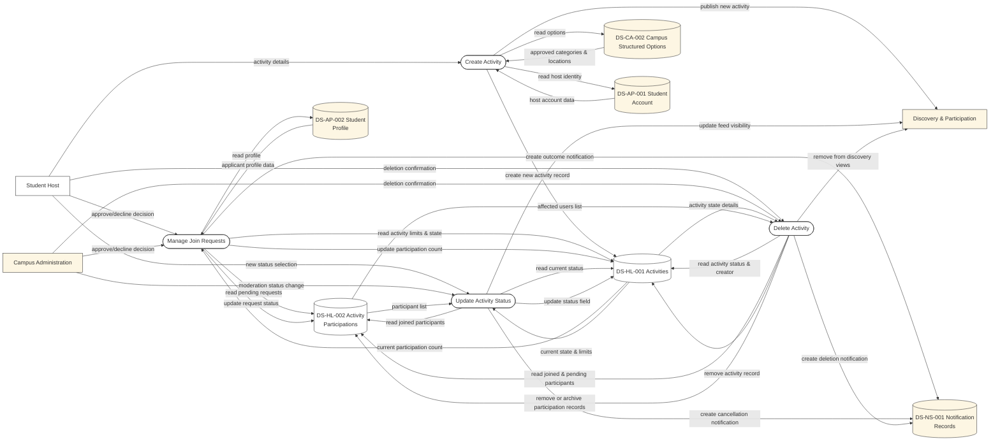
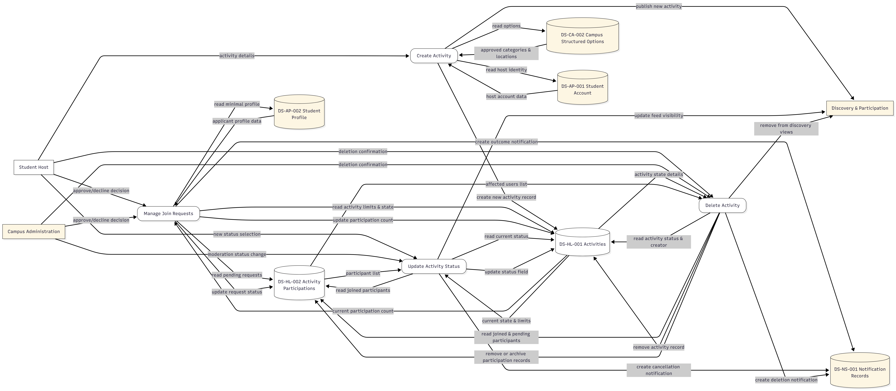

# H\&L DFD

```mermaid
flowchart LR
    %% Styles
    classDef entity fill:#ffffff,stroke:#333333,stroke-width:1px
    classDef entityYellow fill:#fdf6e3,stroke:#333333,stroke-width:1px
    classDef process fill:#ffffff,stroke:#333333,stroke-width:1px,rx:15,ry:15
    classDef datastore fill:#ffffff,stroke:#333333,stroke-width:1px
    classDef datastoreYellow fill:#fdf6e3,stroke:#333333,stroke-width:1px

    %% External Entities and Adjacent Subgroups (Yellow)
    CampusAdmin[Campus Administration]:::entityYellow
    DiscPart[Discovery & Participation]:::entityYellow
    
    %% Internal Entities
    Host[Student Host]:::entity

    %% Logical Processes
    CreateAct([Create Activity]):::process
    ManageReq([Manage Join Requests]):::process
    UpdateStat([Update Activity Status]):::process
    DeleteAct([Delete Activity]):::process

    %% Data Stores (Internal)
    DS_HL001[(DS-HL-001 Activities)]:::datastore
    DS_HL002[(DS-HL-002 Activity<br>Participations)]:::datastore

    %% Data Stores (External - Yellow)
    DS_CA002[(DS-CA-002 Campus Structured Options)]:::datastoreYellow
    DS_AP001[(DS-AP-001 Student<br>Account)]:::datastoreYellow
    DS_AP002[(DS-AP-002 Student<br>Profile)]:::datastoreYellow
    DS_NS001[(DS-NS-001 Notification<br>Records)]:::datastoreYellow

    %% --- Data Flows ---

    %% Create Activity
    Host -->|activity details| CreateAct
    CreateAct -->|read options| DS_CA002
    DS_CA002 -->|approved categories & locations| CreateAct
    CreateAct -->|read host identity| DS_AP001
    DS_AP001 -->|host account data| CreateAct
    CreateAct -->|create new activity record| DS_HL001
    CreateAct -->|publish new activity| DiscPart

    %% Manage Join Requests
    Host -->|approve/decline decision| ManageReq
    CampusAdmin -->|approve/decline decision| ManageReq
    ManageReq -->|read pending requests| DS_HL002
    ManageReq -->|read activity limits & state| DS_HL001
    DS_HL001 -->|current participation count| ManageReq
    ManageReq -->|read profile| DS_AP002
    DS_AP002 -->|applicant profile data| ManageReq
    ManageReq -->|update request status| DS_HL002
    ManageReq -->|update participation count| DS_HL001
    ManageReq -->|create outcome notification| DS_NS001

    %% Update Activity Status
    Host -->|new status selection| UpdateStat
    CampusAdmin -->|moderation status change| UpdateStat
    UpdateStat -->|read current status| DS_HL001
    DS_HL001 -->|current state & limits| UpdateStat
    UpdateStat -->|update status field| DS_HL001
    UpdateStat -->|update feed visibility| DiscPart
    UpdateStat -->|read joined participants| DS_HL002
    DS_HL002 -->|participant list| UpdateStat
    UpdateStat -->|create cancellation notification| DS_NS001

    %% Delete Activity
    Host -->|deletion confirmation| DeleteAct
    CampusAdmin -->|deletion confirmation| DeleteAct
    DeleteAct -->|read activity status & creator| DS_HL001
    DS_HL001 -->|activity state details| DeleteAct
    DeleteAct -->|read joined & pending participants| DS_HL002
    DS_HL002 -->|affected users list| DeleteAct
    DeleteAct -->|remove activity record| DS_HL001
    DeleteAct -->|remove or archive participation records| DS_HL002
    DeleteAct -->|remove from discovery views| DiscPart
    DeleteAct -->|create deletion notification| DS_NS001
```

