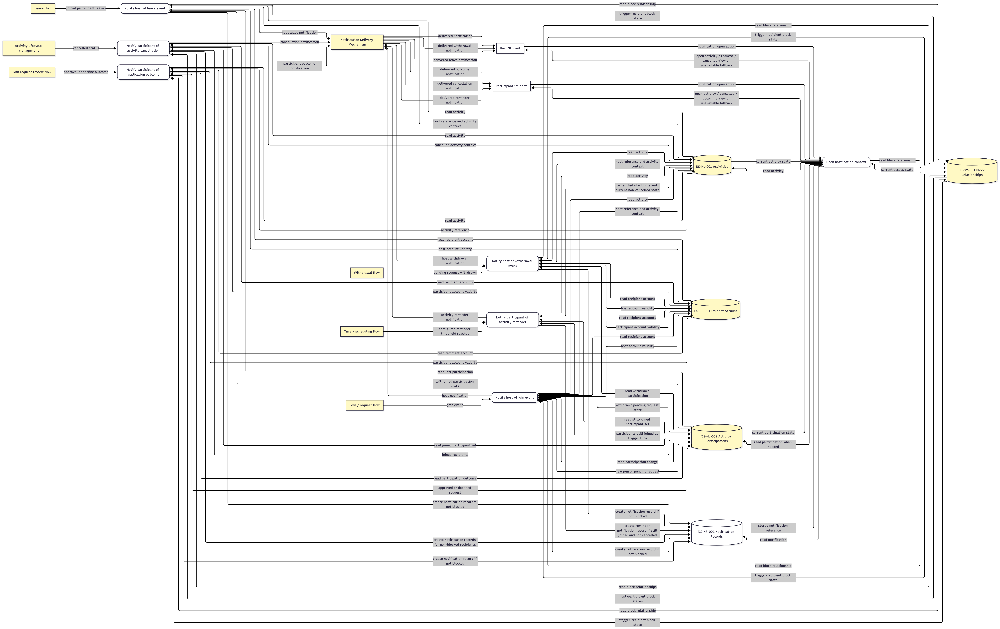
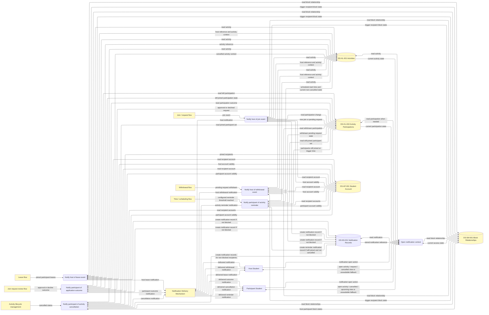
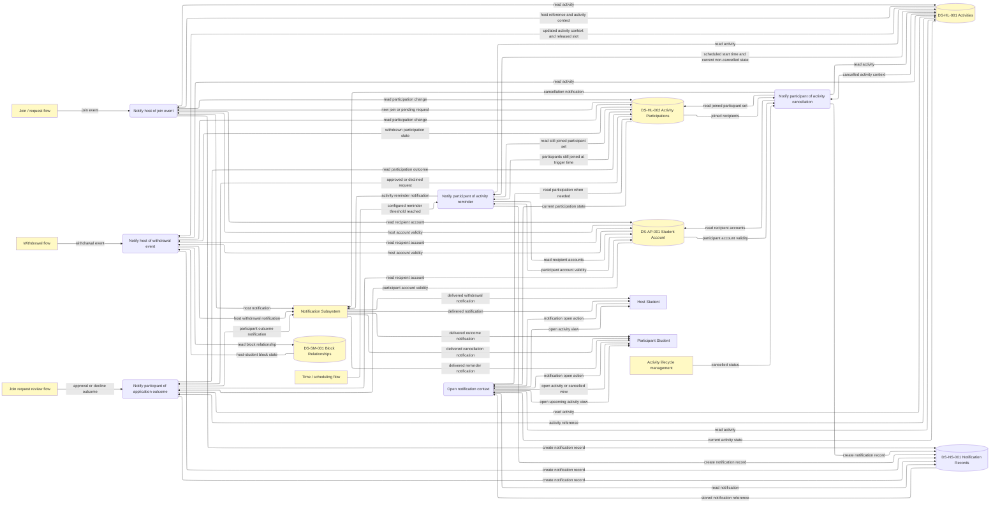
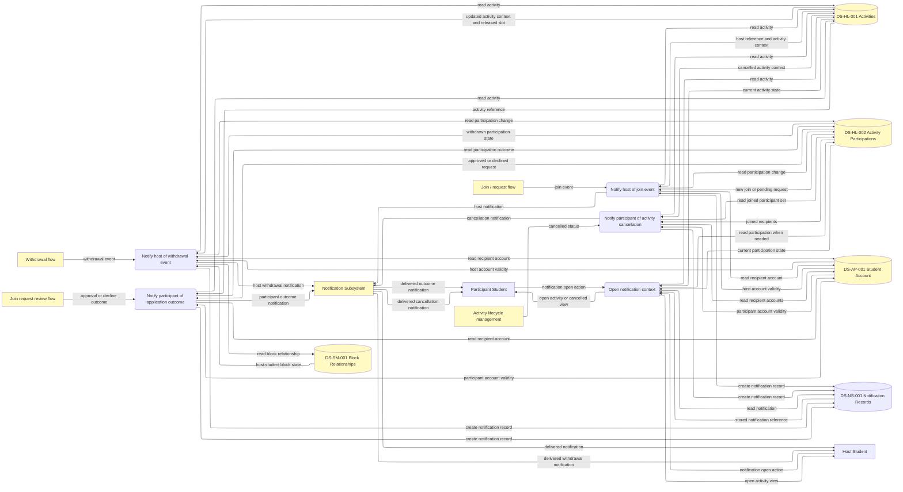
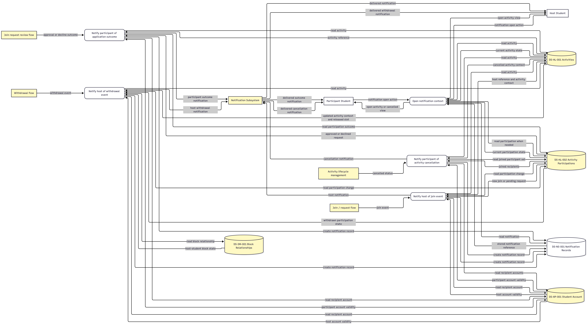
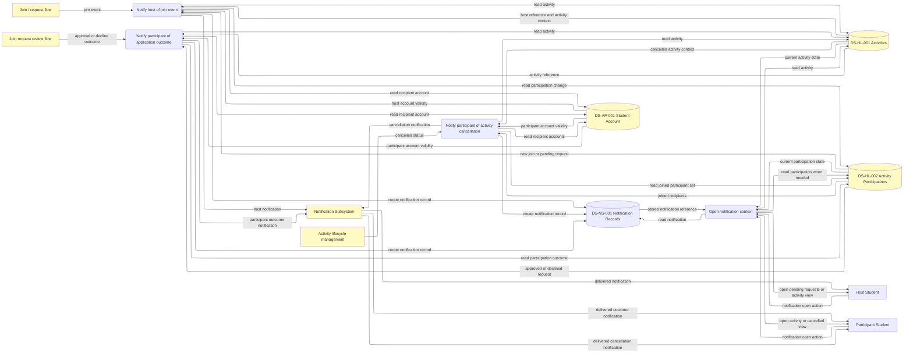
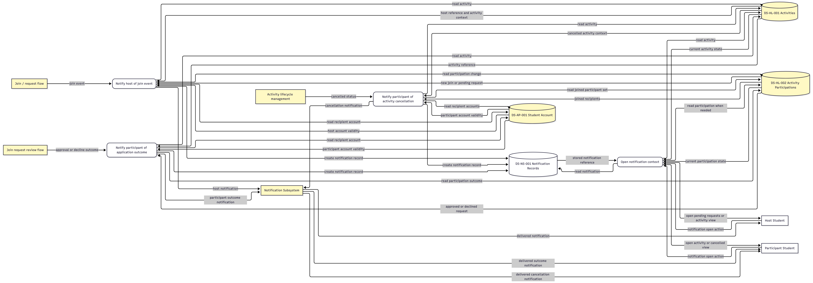

# NSF - DFD

# V4.0

# V3.0

review:

Added a new **activity reminder notification branch** to NSF with the process **“Notify participant of activity reminder.”**

* This branch models **Receive Activity Reminder** as part of the **current MVP subgroup scope**, even though the earlier requirements tables still classify **US-11 / FR-1101 / NFR-24** as postMVP and must be updated separately.
* Added a **time / scheduling trigger area** so the reminder is modeled as a system-detected event rather than as a manually initiated action.
* The reminder branch now reads **DS-HL-001 Activities** for the scheduled start time and current lifecycle state, and reads **DS-HL-002 Activity Participations** to identify only participants who are **still joined** at trigger time.
* Incorporated the alternate-scenario suppression rules:
  &#x20; \* **no reminder if the student is no longer joined**;
  &#x20; \* **no reminder if the activity is already cancelled**;
  &#x20; \* the **cancellation flow supersedes** the reminder flow.
* Updated **Open notification context** so that, when the participant taps the reminder, it opens the **relevant upcoming activity view**.
* Made the structural dependency explicit: reminder logic depends on activity scheduling data already defined upstream in **Create Activity / Set Activity Date and Time**, depending the current UC taxonomy.

# V2.0

review:
Added a new **withdrawal notification branch** to NSF with the process **“Notify host of withdrawal event.”**

* &#x20;This branch now covers both cases: a student **withdraws a pending request** or **leaves an already joined activity**. 
* &#x20;Added a read from **DS-SM-001 Block Relationships** because the **block check must happen inside NSF**. 
* &#x20;Updated the withdrawal notification logic so it includes: 
  * &#x20;who withdrew, 
  * &#x20;from which activity, 
  * &#x20;and that **a slot was freed**. 
* &#x20;Updated **Open notification context** so that, when the host taps the notification, it opens the **activity view**. 
* &#x20;Added the priority rule: **the first valid event wins**, and later conflicting notification events are suppressed.

# V1.0

