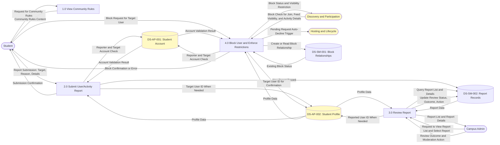
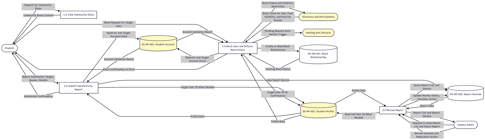
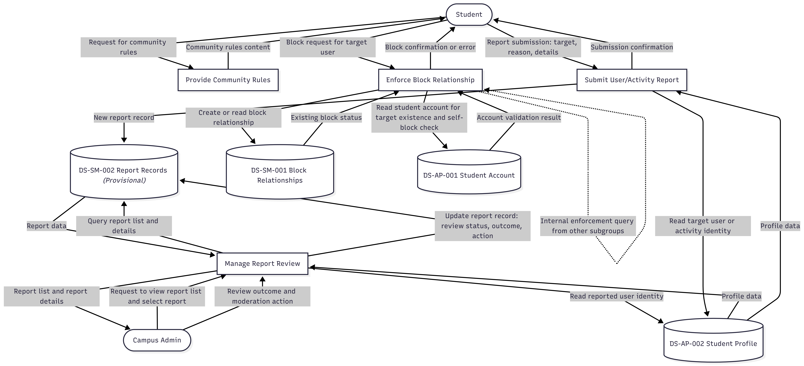

# SM - DFD

# V2.0

review: This version reflects the clarified logic:

* **community rules are static content**, so `Provide Community Rules` has **no dedicated data store**
* **report review is based on&#x20;****`DS-SM-002 Report Records`**, not on a mandatory live read of `Activities`
* `DS-SM-002` is no longer shown as **Provisional**
* `DS-AP-001` and `DS-AP-002` are treated as **upstream reused stores**
* only the **concrete adjacent-subgroup interface** that is already justified is drawn explicitly: **Discovery and Participation** querying block status
* the block is now treated as **symmetric in practice**, it prevents new join/request interactions in both directions, auto-declines pending requests when the block is created, does not retroactively remove existing shared participation, restricts activity details and profile exposure, and is modeled as **upstream interaction prevention rather than notification suppression**.

# V1.0

code:
flowchart TD

%% External

Student(\[Student])

CampusAdmin(\[Campus Admin])

%% Process

P\_SM\_01\["Provide Community Rules"]

P\_SM\_02\["Submit User/Activity Report"]

P\_SM\_03\["Manage Report Review"]

P\_SM\_04\["Enforce Block Relationship"]

%% Data store

DS\_SM\_002\[("DS-SM-002 Report Records \<i>(Provisional)\</i>")]

DS\_SM\_001\[("DS-SM-001 Block Relationships")]

DS\_AP\_001\[("DS-AP-001 Student Account")]

DS\_AP\_002\[("DS-AP-002 Student Profile")]

%% external—process

Student -->|Request for community rules|P\_SM\_01

P\_SM\_01 -->|Community rules content|Student

Student -->|Report submission: target, reason, details|P\_SM\_02

P\_SM\_02 -->|Submission confirmation|Student

CampusAdmin -->|Request to view report list and select report|P\_SM\_03

P\_SM\_03 -->|Report list and report details|CampusAdmin

CampusAdmin -->|Review outcome and moderation action|P\_SM\_03

Student -->|Block request for target user|P\_SM\_04

P\_SM\_04 -->|Block confirmation or error|Student

%% process—data store

P\_SM\_02 -->|New report record|DS\_SM\_002

P\_SM\_03 -->|Query report list and details|DS\_SM\_002

DS\_SM\_002 -->|Report data|P\_SM\_03

P\_SM\_03 -->|Update report record: review status, outcome, action|DS\_SM\_002

P\_SM\_04 -->|Read student account for target existence and self-block check|DS\_AP\_001

DS\_AP\_001 -->|Account validation result|P\_SM\_04

P\_SM\_04 -->|Create or read block relationship|DS\_SM\_001

DS\_SM\_001 -->|Existing block status|P\_SM\_04

%% read profile for report

P\_SM\_03 -->|Read reported user identity|DS\_AP\_002

DS\_AP\_002 -->|Profile data|P\_SM\_03

%% submit profile for report

P\_SM\_02 -->|Read target user or activity identity|DS\_AP\_002

DS\_AP\_002 -->|Profile data|P\_SM\_02

%% cross process research

P\_SM\_04 -.->|Internal enforcement query from other subgroups|P\_SM\_04

